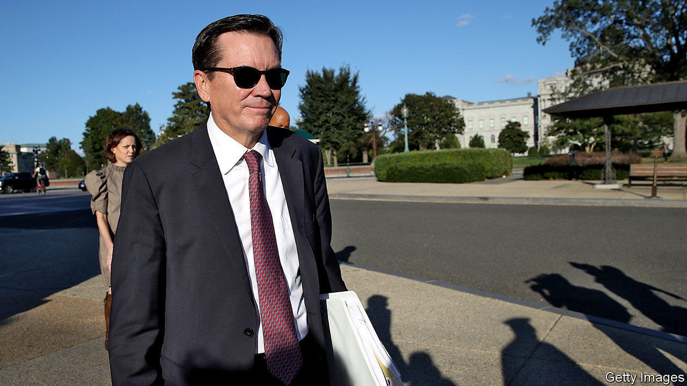

###### The spooky state

# What does Donald Trump want from America’s intelligence services? 

##### The sacking of Michael Atkinson highlights the president’s push for personal loyalty 

 

> Apr 11th 2020 

ON APRIL 3RD Donald Trump fired Michael Atkinson, the inspector-general for America’s intelligence community (IC). Mr Atkinson’s sin seems to have been following the law. He told Congress, as he was legally bound to do, about a whistleblower’s complaint regarding Mr Trump’s phone call with Ukraine’s president, over which Mr Trump was impeached last year. Mr Atkinson’s sacking highlights, obviously, Mr Trump’s vindictiveness. But it also reveals, more interestingly, what he wants from the IC.

The phrase “intelligence community” refers to a long list of America’s federal intelligence-gathering services. There are no fewer than 17, including the Central Intelligence Agency, the Federal Bureau of Investigation and the map-making National Geospatial Intelligence Agency, as well as the intelligence arms of the armed forces and several cabinet departments. Overseeing them is the Office of the Director of National Intelligence, a cabinet-level co-ordinating position created after the attacks of September 11th 2001.


Tension is inherent to the relationship between any president and the IC. Presidents are politicians. Intelligence analysis ought to be apolitical and dispassionate. Analysts must sometimes deliver information that presidents do not want to hear. Some presidents have mistrusted the IC: Richard Nixon believed it was filled with Ivy Leaguers who looked down on him. Some sidelined it: when a small plane crashed on the White House lawn two years into Bill Clinton’s presidency, some in the IC joked that it was the head of the CIA trying to get a meeting with the domestically focused president. Some have challenged it: Barack Obama, one analyst recalled, used to listen to his daily brief, and then ask “the hardest question—the one you hoped he wouldn’t ask you.”

Mr Trump, by contrast, seems to want an IC that is personally loyal to him, and therefore politicised, rather than analytical and independent. He came into office primed to distrust the IC, which first raised concerns over his campaign’s links with Russia. That mistrust—intensified by his suspicion for civil servants who have served under multiple administrations, as opposed to political appointees whose careers he controls—has only deepened over the course of his tenure.

James Comey, a former director of the FBI, got the axe after declining to say that Mr Trump was not personally under investigation for his campaign’s links with Russia, and, reportedly, for failing to promise Mr Trump “loyalty” at a private dinner. In February Joseph Maguire was forced out as acting Director of National Intelligence (DNI) after a subordinate told Congress that Russia is intervening to help Mr Trump win this year’s election. He replaced Mr Maguire with Ric Grenell, a caustic political operative with no intelligence background.

The president uses opprobrium to intimidate those he does not fire. He has publicly derided IC officials who disagree with him as “extremely passive and naive”, accused the IC of using its powers to “surveil and abuse the Trump campaign”, compared American intelligence professionals to Nazis and, according to Andrew McCabe, a former FBI acting director, taken the word of Vladimir Putin over American analysts’.

Mr Trump has similarly scant regard for the intelligence product. Ideally, presidents do not ask their analysts for advice; presidents tell them what they want to do, and ask them to forecast what is likely to happen depending on how they decide to do it. Douglas London, a 34-year veteran of the CIA’s clandestine service, explains that Mr Trump “just wants to see intelligence that aligns with his beliefs, as opposed to information he can ponder to inform his decision-making”.

The president can be dismissive of intelligence that fails to confirm his views. He recently mocked the IC’s findings on current Russian electoral interference as “rumour” and “disinformation”. He can also be cavalier. Soon after taking office, he revealed classified information provided by an American ally to Russia’s foreign minister. In August 2019, after an Iranian rocket launch failed, Mr Trump tweeted an image of the launch site that probably came from a spy satellite or drone.

Some harms from this behaviour are clear. Revealing sensitive information makes others warier of sharing it with America, which risks leaving America less informed about its adversaries. A president with more respect for the IC might not have ignored its warnings about covid-19 and sprung into action sooner. Senior IC officials seem less likely, with Mr Grenell as DNI, to warn of election interference—at least in Mr Trump’s favour.

Other harms are more nebulous and harder to forecast. Because the IC works in the shadows, its successes tend to be secret and its failures evident only in retrospect. Perhaps Mr Trump will be lucky. Perhaps IC professionals’ habits of clear-eyed analysis and co-operation with allies will persist, despite ructions at the top. But analytical independence is an essential part of a functioning intelligence service, and any actions that weaken it risk weakening the service—particularly as senior professionals leave, and those who remain learn to toe the line in order to survive.

This may reverse under a different president. So could, with enough time and reassurances, other countries’ wariness to share their secrets. But a second Trump term could leave the IC less a collection of independent analysts than an institution with broad powers to operate in secret for the president’s personal and political benefit—without, as Mr Atkinson’s sacking warns, any real oversight.■ 

Dig deeper:


