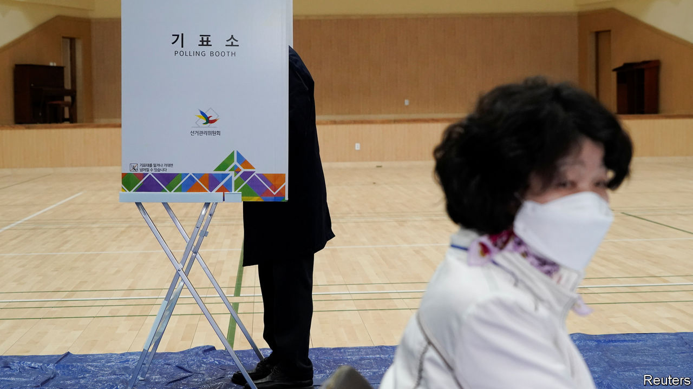

###### Infectious enthusiasm

# A landslide for South Korea’s ruling party in parliamentary elections 

##### Voters were happy with the government’s handling of the covid-19 pandemic 

 

> Apr 18th 2020 

THE YOUNG man outside the polling station was adamant. “Of course it was right to hold these elections. It’s our basic right,” said Kim Su-ho, a 24-year-old voter in Seoul, the capital. “We’re not like Europe or America where they failed to slow the spread. There was no reason to postpone them.” His fellow South Koreans, it appeared, agreed: by the time the polls closed on April 15th, 66.2% of eligible voters had cast a ballot, more than in any parliamentary election since 1992. As much of the world remained in virus-induced lockdown, South Koreans donned face masks and plastic gloves to show that even in a pandemic, the journey to the polling booth is essential.

The virus-defying vote brought a resounding victory for the ruling Minjoo (Democratic) Party of Moon Jae-in, the president. Minjoo won 180 of the 300 seats in the National Assembly, including seats won by an affiliated party it set up to contest the proportional portion of the vote in the country’s hybrid electoral system. (At the previous election, in 2016, Minjoo won 123 seats.) United Future, the main conservative opposition party, came a distant second with 103 seats including proportional ones from its affiliate, down from 122 seats in 2016. Hwang Kyo-ahn resigned as the conservatives’ leader after losing his constituency in central Seoul. Minor parties, which had contested the election in record numbers following the introduction of new electoral rules designed to improve their chances, barely featured.


The main reason for Minjoo’s unprecedented success seems to have been the government’s response to the covid-19 pandemic. Before the outbreak, Mr Moon’s fortunes had been taking a turn familiar to previous South Korean presidents towards the middle of their term. His flagship policies of reining in the country’s big conglomerates and pursuing rapprochement with North Korea had flagged. But over the past few weeks, as the number of new confirmed cases of covid-19 fell below 50 a day, Mr Moon’s approval rating rose to its highest level in 18 months. With the opposition in disarray, the evident competence of South Korea’s public-health authorities rubbed off on the ruling party.

The result bodes well for Mr Moon’s agenda during the remaining two years of his term. The president is still short of the two-thirds majority required to pass his proposals for constitutional reform. But Minjoo’s absolute majority will put an end to the parliamentary deadlock, if not the physical altercations, that have hampered lawmaking during the early stages of his term. It will allow the ruling party to push through the remaining elements of Mr Moon’s promised reforms of the prosecution service, which a majority of South Koreans still regard as too powerful. It will also ease the process for appointments that are made by the president but must be approved by parliament, such as the prime minister and the country’s chief judges. More immediately, the government will be able to implement the economic stimulus it has proposed to contain the fallout from the covid-19 pandemic. In particular, a supplementary budget to award cash handouts to the bottom 70% of households, which the opposition has criticised, should now sail through.

Still, claims that the election marks a fundamental shift in South Korean politics seem premature. The partisan divide between progressive strongholds in Seoul and the south-west and the conservative heartland in the south-east was even more pronounced than at the previous election. Many of Minjoo’s additional seats were won back from the People’s Party, a progressive outfit that split from Minjoo before the vote in 2016. And the result does little to ease the external difficulties with which the government will continue to have to grapple. North Korea has reverted to its typical, hostile form, and has conducted five sets of missile tests so far this year. And however successful South Korea has been in managing the covid-19 outbreak, that will not shield it from the global downturn the virus is causing. ■

