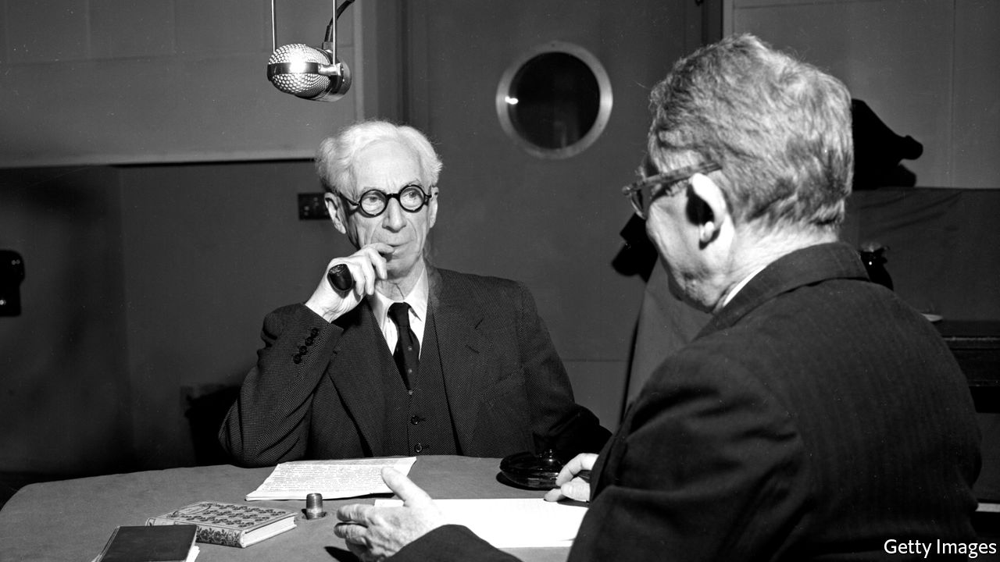

###### Home Entertainment

# Listen to Bertrand Russell, the English Voltaire 

##### His greatest hits are a good substitute for the intelligent conversation you are missing 

 

> Apr 18th 2020 

 


AMONG MANY other achievements, Bertrand Russell is the only philosopher to have cut an album of his work. Released in 1962, “Bertrand Russell Speaking” was a greatest hits of the many interviews he had given. Subjects range from science and religion on side A, to “taboo morality” and “fanaticism” on side B. If discovered in the bedroom of a teenager of the time, the record might have seemed as scandalous as any rock’n’roll track. Because, as well as being a pioneering logician, Russell was an uncompromising freethinker—and an early advocate of free love.

Fifty years after his death, Russell’s voice—an enduring call to liberal dissent—is preserved on YouTube, where self-isolating listeners can find a trove of his words and wisdom. With an unfailing wit, the recordings cover mathematics, literature, atomic physics and history. Entertaining and improving at once, they are a delightful stand-in for the intelligent conversation you might currently be missing.


Russell’s personal anecdotes are a highlight. Brought up by a grandfather who was twice prime minister, he grew up in the patrician splendour of the Liberal establishment. Once, at a dinner, the young Russell “was left tête-à-tête” with William Gladstone, the “Grand Old Man” of British politics. “I was only 17 and very, very shy, and it was by far the worst experience of my life,” Russell recalled. “Nothing since has terrified me.” He remembered Gladstone saying only one thing: “This is very good port, but why have they given it me in a claret glass?”

Despite his Victorian upbringing, Russell’s views and legacy are remarkably contemporary. He once speculated that only six people had read his “Principia Mathematica”, three of whom had been murdered by Hitler; nevertheless, the book laid the early foundations of computer science. Russell helped establish the analytic tradition, which rejected grand dogmas in favour of clear and precise inquiry, and became the basis of most university philosophy courses. And he was a famously committed atheist, using his formidable rhetorical skills to prosecute that cause.

In a debate broadcast by the BBC in 1948 Russell came up against Frederick Copleston, a Jesuit priest, in one of the listening public’s earliest exposures to the philosophical arguments against God. Thanks to YouTube, you can listen to the stand-off again. Copleston, palpably irritated and wearied by his opponent’s obstinance, pleads: “We seem to have reached an impasse.” “We can press the point a little I think,” Russell cheekily replies.

On his death, Russell was eulogised as “the English Voltaire”, a witty, polymathic rebel. As with Voltaire, though a few of his books are still in publication, most now gather dust. But through the alchemy of the internet, his voice lives on. One appreciative listener has commented: “Imagine if this guy had a podcast.” The informal online archive will have to suffice. ■

