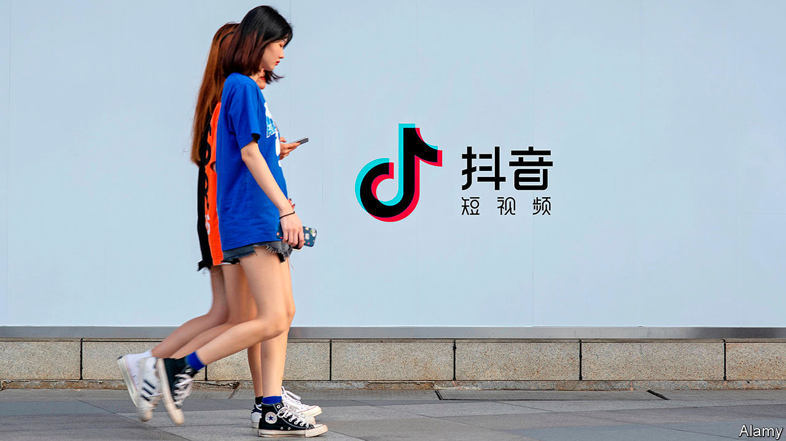

###### ByteDance

# ByteDance is going from strength to strength 

##### America doesn’t like it one bit 

 

> Apr 18th 2020 

AS COVID-19 has forced the world’s teenagers out of school and into their rooms, they have turned to a familiar digital companion, TikTok. The short-video app was downloaded 115m times in March. Its nearly 1bn regular users enjoy silly clips of dog antics alongside pandemic advice from the World Health Organisation. Collectively, TikTok videos tagged with #coronavirus have been watched 53bn times. 

TikTok’s popularity over the past two years has shone the spotlight on ByteDance, its Beijing-based developer. Founded by a Chinese computer scientist, Zhang Yiming, in 2011, it is now the world’s biggest unlisted technology “unicorn”, recently valued at between $90bn and $100bn. It is also the only technology firm bar Apple with more than 100m users in both China and America, where TikTok has taken on the likes of YouTube and Instagram. 


And ByteDance isn’t done. The 60,000 people in its buzzy offices—“We are like flies,” says one former employee—crank out one app after another. In the past year it has launched a worldwide corporate-software service (Lark), a music-streaming app in India and Indonesia (Resso) and, in China, a messaging rival to WeChat. As other firms sack workers amid covid-19, ByteDance is hiring 10,000 globally. It plans to employ 30,000 on top of that this year. 

ByteDance is not the first Chinese firm with foreign ambitions. Commodity giants such as CNOOC, an oil firm, have been buying foreign reserves, and rivals, since the 1990s. In the past decade industrial giants have pursued Western competitors from carmaking (as with Geely’s purchase of Volvo) to chemicals (ChemChina’s of Syngenta). More haphazardly, conglomerates like Fosun and Anbang splurged on trophy assets (including Club Med and the Waldorf Astoria hotel, respectively). 

Unlike most of its peripatetic predecessors, though, ByteDance has built its empire by making products that appeal beyond China. It is China’s first global software giant. It has also courted foreign investors. Filings in Hong Kong show that it has used an arrangement called the “Sina structure”, which allows it to accept money from abroad, since its founding (many Chinese tech firms turn to this structure only when eyeing a stockmarket listing in America). Around 80% of ByteDance’s investors are non-Chinese. So are four of its five board members. The other is Mr Zhang.

All this helps ensure ByteDance is not, in contrast to many Chinese tech upstarts, in hock to Alibaba, Baidu and Tencent—which is handy, for Bytedance competes with China’s tech titans for ad revenue. It makes most of its money selling ads in its two main Chinese apps: Douyin, a Chinese TikTok, and Toutiao, a multimedia-and-news app akin to Facebook’s newsfeed (its WeChat rival, Duoshan, disappointed).

How much money it makes, exactly, is unclear: as a private company Bytedance does not publish its accounts. But leaks and statements from investors put last year’s revenue at between 104bn yuan and 140bn yuan ($15bn-20bn), more than Uber, Snapchat and Twitter combined. Its ad revenues in China surpassed Tencent’s and Baidu’s and now trail only those of Alibaba. It reportedly turned a profit in June 2019, a feat in the world of loss-making unicorns. 

If the firm generates $25bn in sales this year, as it is expected to despite covid-19, it will have done so three years faster than Facebook. It is the only big Chinese firm whose share of the domestic advertising market is growing fast, from 9% to 17% in 2019, according to Bernstein, a research firm. A recently launched advertising network, Pangle, which lets advertisers reach consumers across any of its non-Chinese apps, may at last help it monetise TikTok. 

No wonder American rivals are trying to clip its wings. Facebook’s TikTok clone, Lasso, has flopped. YouTube is said to be developing another (called Shorts). But the biggest threat has emerged in the form of America’s government, wary of China’s rise in any sphere.

Politicians in Washington fear that data on American users is being handed to Beijing; that Chinese algorithm designers are infecting impressionable Western youngsters with communist propaganda; and that ByteDance content is censored in line with party whims. In March two Republican senators introduced a bill that would ban TikTok from all government devices. The Committee on Foreign Investment in the United States (CFIUS) is reviewing ByteDance’s acquisition in 2018 of Musical.ly, another app, which had 60m users in America and Europe.

In statements, TikTok has said that it stores all American “user data in the United States” and that its American operations are “not influenced by any foreign government, including the Chinese government”. The firm is trying to mollify critics and has hired prominent security and legal experts in America to help it. Last month it opened a “transparency centre” in Los Angeles, where it promises to share information about its content-moderation, privacy and security controls, and said it would stop using moderators in China to handle content from users outside the country.

That, most lawyers and technologists reckon, may help get CFIUS off its back. Listing ByteDance in Hong Kong, which is under consideration, may also foster trust. So would anointing a non-Chinese successor—though, at 37, Mr Zhang may not be ready to retire. As a last resort, he is said to be willing to contemplate spinning TikTok off. That would cement the digital divide between China and the West—until another hit ByteDance app tries to bridge it. ■

