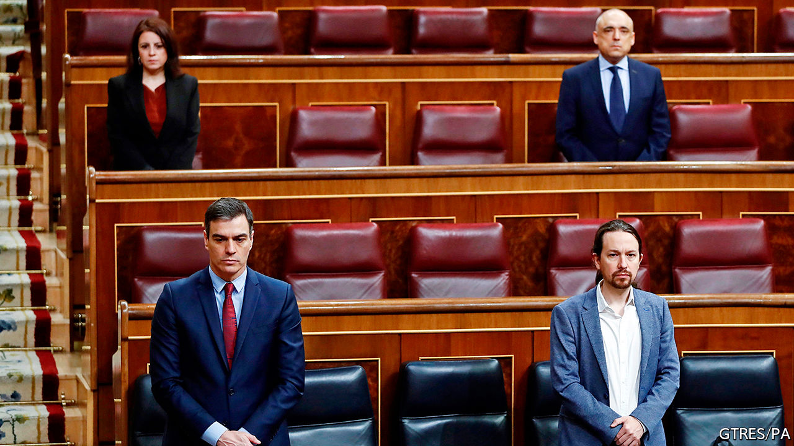
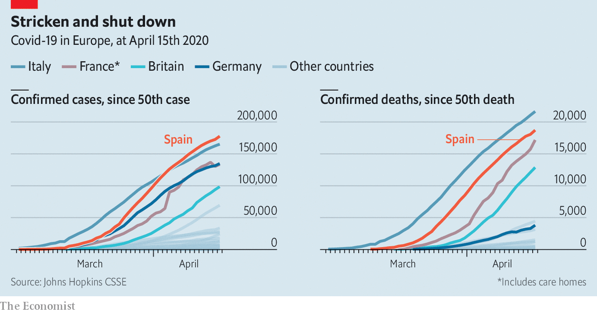

###### From lockdown to smackdown

# Nasty politics returns to Spain 

##### As the first wave of the pandemic peaks, politicians go back to bickering 

 

> Apr 18th 2020 

Editor’s note: The Economist is making some of its most important coverage of the covid-19 pandemic freely available to readers of The Economist Today, our daily newsletter. To receive it, register . For our coronavirus tracker and more coverage, see our 

BACK LAST summer Pedro Sánchez, Spain’s Socialist prime minister, said that if he agreed to a coalition government with Podemos, a far-left outfit, “I wouldn’t sleep at night.” After another indecisive election—the fourth in four years—he formed just such a coalition, which took office in January. Weeks later Spain was laid low by the novel coronavirus, and the novel minority coalition is struggling to cope, leaving the prime minister scrambling for broader support.

Mr Sánchez’s decision to impose a state of emergency and lockdown on March 14th, centralising command of health care and security in the national government, received widespread public and political backing. Five weeks on, the hospitals are no longer overflowing and the peak of the epidemic has passed, for now at least. The government is starting to think, gingerly, about how and when to get the country back to work (see ). But the toll has been heavy. By April 16th 18,812 people had died, according to official figures. The economy is in meltdown: 900,000 jobs were lost in March alone, some 3.5m workers are furloughed, and the IMF forecasts that Spain’s GDP will contract by 8% this year, the second-biggest fall in Europe after Italy.


The government must deal with all this with a slender stock of political capital. During the lockdown public opinion has been volatile. Approval for the government’s handling of the virus fell from 64% to 39% during March, according to Metroscopia, a pollster. Much of the opposition has broken ranks. Vox, a hard-right party with 52 of the 350 seats in Congress, wants a “national emergency government” of technocrats. Pablo Casado, the leader of the mainstream conservative People’s Party (PP), has accused Mr Sánchez of “arrogance, incompetence and lies”. This contrasts with the rallying round seen in many other European countries.

Mr Sánchez has responded by calling for a “pact for national reconstruction”, in theory involving the opposition, regional governments, businesses and unions. This is a conscious echo of the Moncloa Pacts of 1977, a set of agreements on economic measures between government and opposition which were a pillar of Spain’s transition from dictatorship to democracy. One poll found 92% in favour of another such pact—but 79% thought it improbable.

 


One explanation for the government’s difficulties is its own shortcomings, both technical and political. It bungled an announcement on March 28th that the lockdown would temporarily tighten, leaving many vital details initially uncertain. It is harder to co-ordinate such measures in a decentralised country with powerful regional governments. Even so, Mr Sánchez’s practice has been to pre-announce measures, and to consult only after their implementation. That has left businesses and some regional presidents fuming. “It’s a government that lacks not just experience but also deep knowledge of the state and how it works,” says a former senior official. “The sense of improvisation is very strong.”

Podemos and its leader, Pablo Iglesias, have added to the problems. Perhaps with some justification, he has seemed desperate to leave his ideological mark on government policy. At his instigation the government issued a decree making sackings during the pandemic unlawful, even as it has forced many businesses to suspend trading. Mr Iglesias’s hostility to the private sector and the monarchy (and the Moncloa Pacts) arouses widespread mistrust. The government finds it hard to speak with one voice; Mr Sánchez has had to devote much time and effort to internal debate.

Governments everywhere have struggled to deal with a crisis that demands swift, momentous and costly decisions. In Spain, a fragmented opposition adds to the problems. “We’re not starting from a blank slate, but rather from years of institutional deterioration,” says Sandra León, a political scientist. The country’s political system has not regained its balance since the last economic slump, of 2008-12, which fractured a stable two-party system into five and fuelled separatism in Catalonia.

Political competition is now not just between left and right but within each of those two blocs, which makes it more confrontational. Take Mr Casado’s position. He heads what was once the loyal opposition, but he must now also try to contain Vox. Another battleground will be over decentralisation. Quim Torra, the separatist head of the Catalan administration, has attempted to exploit the crisis to claim that independence would have provided more protection against the virus. Since he still runs nursing homes and hospitals in his region, that has cut little ice. Rather, there is evidence from polling data that in this crisis Spaniards want the centre to take charge as Mr Sánchez has done, argues Ms León. But that is inimical to the moderate and influential Basque nationalists, as well as to their Catalan counterparts.

Some in the PP say that one condition for a national agreement should be the departure of Podemos from the government. Mr Sánchez has ruled that out. Although it was his route to office, he knew the tie to Podemos “wouldn’t work for governing”, says Jorge del Palacio of King Juan Carlos University in Madrid. But “he can’t break the coalition without an alternative.” A centrist grand coalition looks unlikely, though it is not impossible. The coming months of mass unemployment, business failures and spiralling public debt will be gruelling for Spain and for its government. The last crisis upended the country’s politics in unforeseen ways. This one could yet do so, too. ■

Dig deeper:For our latest coverage of the covid-19 pandemic, register for The Economist Today, our daily , or visit our 

