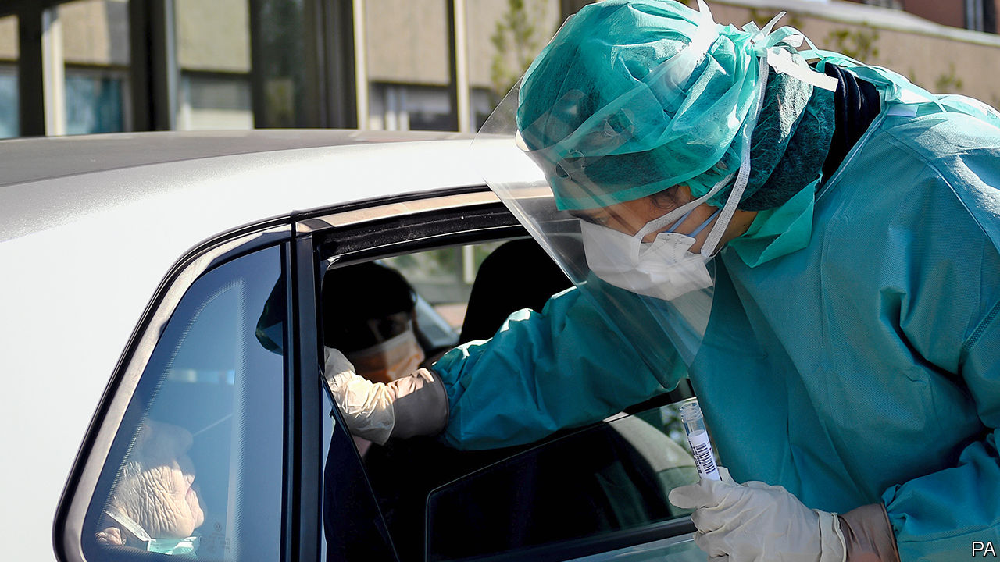

###### How to ease a covid-19 lockdown

# Fumbling for the exit strategy 

##### Overwhelmed by the crisis, most governments are ill-prepared for what comes next 

 

> Apr 18th 2020 

Editor’s note: The Economist is making some of its most important coverage of the covid-19 pandemic freely available to readers of The Economist Today, our daily newsletter. To receive it, register . For our coronavirus tracker and more coverage, see our 

SUDDENLY EVERYONE has a plan. Ideas for exiting the covid-19 lockdown are spreading faster than the virus ever did. Spain has let builders return to work, Italy has opened stationers and bookshops, Denmark is allowing children back into nurseries and primary schools. South Africa’s opposition is calling for a relaxed “smart lockdown”. In America President Donald Trump has been sparring with state governors over who should decide what reopens when.

Every country is different, but already two things are clear. First, governments need to explain to their people that the world is not about to return to normal. Without a vaccine or a therapy, life will be constrained and economies will remain depressed. Second, testing and contact-tracing are vital to keeping the virus at bay. Countries that failed to invest enough in them when the disease first emerged in China risk repeating the mistake.


The need to devise exit plans is urgent. The alarming cost of hard lockdowns is becoming clearer. This week the IMF forecast that extending full lockdowns well into the third quarter of 2020 would turn a 3% contraction of the world economy this year into a 6% one. An analysis by Norway’s covid-19 task-force, published on April 7th, compared an 18-month hard lockdown with a “slowdown” and concluded that the statistical value of the extra lives it saved would be dwarfed by its long-term cost.

And yet, however much exits are needed, they are also hard, because most of the world remains susceptible to a second wave of covid-19. Spain is the country with the highest number of recorded cases per head. Yet only a tiny share of the population has been infected. Even if the actual number of cases were 100 times higher than official numbers suggest, two-thirds of its population would still be vulnerable—more if immunity is short-lived. Lockdowns have been sold as a way to “beat” covid-19. In fact, they reset the clock. Having failed to stop the disease taking hold, countries have bought themselves a chance to try again. But unless they act differently the virus will surge once more.

What should they do? Governments need to choose from the menu of options by comparing the costs of each measure with the benefits it brings—and the calculus will differ in different countries. Should masks be mandatory? (Yes, if supplies are adequate.) Should schools take pupils back? (More research is needed.) Which industries can safely reopen? (Factories can; hospitality is harder.) Do you shut borders or quarantine travellers? (Quarantine is better.) Policies will evolve as the science improves or the disease flares up. Sometimes, that will mean tightening the rules again.

China offers a snapshot of what this means. Since restrictions were relaxed there the streets have filled up, many people have gone to back to work and life has become more liveable. However, consumers remain anxious so some of them stay at home. The talk is of a 90% economy (see )—better than a 50% economy, certainly, but nonetheless the greatest global economic catastrophe since the 1930s.

Managing this part-locked-in, part-let-out world depends on testing. Testing can tell governments about the running rate of infections and which measures work and which do not. It isolates new cases, allowing the tracing of their contacts, helping arrest the spread of the disease. The better the testing, the less all-embracing the social distancing needs to be, because infected people are routinely removed from the population—in theory it could replace distancing altogether.

Governments talk about testing a lot. It will not be available on a truly mass scale for many months. One cheap substitute is taking temperatures, but people free of fever can still be infectious. Another idea, boosted by recent news of a collaboration between Apple and Google, is to use mobile-phone apps to log contacts automatically so that testing can be targeted on those people most likely to be infected. But the apps need to be widely downloaded to work and they still require vast numbers of testers and tracers to identify new infections and check that people are isolating themselves (see ). One proposal says that America will need 260,000 recruits, up from just 2,200 today (see ). Until governments begin to grapple with such numbers, exits will be underwhelming, dangerous even.

No wonder the world is racing for a vaccine (see ). This is a global effort as it should be—no country has a monopoly on science. Again, though, to produce and distribute a vaccine fast and efficiently calls for hard work today. Without investment now, even before a vaccine has been proven, there will be a shortage of manufacturing capacity, disrupting routine vaccinations for diseases like measles and polio. For as long as there is a shortage some countries may try to corner the market, leaving health workers and the most vulnerable at risk elsewhere.

Talk of exiting lockdowns raises the spirits and justly so. Yet the frustrations and the hard choices are just beginning. ■

Dig deeper:For our latest coverage of the covid-19 pandemic, register for The Economist Today, our daily , or visit our 

