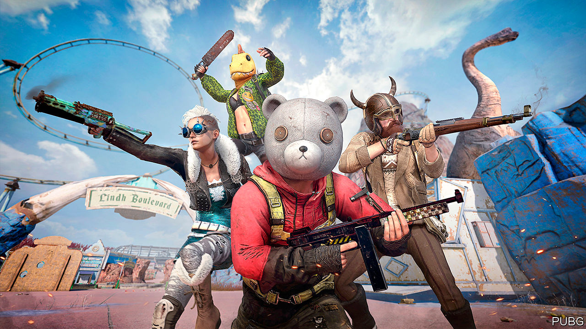

###### Covideo heaven

# Arabs and Persians are battling it out—virtually 

##### Not all governments in the region are amused by a popular video game 

 

> Apr 18th 2020 

Editor’s note: The Economist is making some of its most important coverage of the covid-19 pandemic freely available to readers of The Economist Today, our daily newsletter. To receive it, register . For our coronavirus tracker and more coverage, see our 

IT WAS A fraught conversation, but not for the reason many are these days. As he rummaged around his house, a young Saudi man vented about life under lockdown. The hotel where he works has no guests. Unmarried, he lives at home, with no escape from overbearing parents. Then, perhaps to ease his frustrations, he beat your correspondent to death with a frying pan.

Even before the virus swept the region, video games were popular in the Arab world, with its large, youthful and often idle population. Perhaps none has become a bigger sensation than “PlayerUnknown’s Battlegrounds” (pictured), known as PUBG, or bubji in Arabic. The premise is simple: a group of players, usually 100 of them, are dropped onto an island and fight to the death; the last one standing wins. In-game voice chat is often a mélange of Arabic dialects and Farsi, in a space where young people can socialise away from prying eyes and ears.


The mobile version, which has 50m active users worldwide, is a distraction across the Gulf, everywhere from shisha cafés to five-star-hotel lounges. A researcher estimates that 4m people in Saudi Arabia play it each month. When Iraqis began protesting against their government last year, some came dressed as characters from the game.

The Middle East and Africa are home to 14% of the world’s gamers, says Newzoo, a research firm. A study from 2019 by Northwestern University in Qatar found that close to half of young people in Egypt, Jordan and other Arab countries play at least once a day. Computers are out of reach for some, but gaming lounges are scattered around cities and towns. Muhammad bin Salman, the young Saudi crown prince, unwinds with “Call of Duty”, a shooter franchise, in rather more opulent surroundings.

Both developers and governments see an economic opportunity. The Middle East and Africa generated $5bn in revenue from gaming in 2019—only 3% of the global take, but up by 11% on the previous year. Tencent, the Chinese developer of PUBG, opened an office in Dubai last year. Saudi Arabia hosted a tournament in December with a $300,000 prize pool and hopes to expand the “e-sports” industry. The United Arab Emirates has organised its own events.

Not everyone is so enthusiastic. Young Arabs joke that their acceptable job options are limited to doctor, lawyer, engineer or disappointment. Convincing mum and dad that video games are a career is a hard sell. Iraqi politicians and parents dismiss young people as the “PUBG generation”. Last year parliament banned the game, a decision that proved ineffective. Jordan followed suit in July.

Panics about video games are not unique to the region. Lawmakers in America periodically seek to blame them for school shootings. Simulated violence seems less of a worry for officials in the Middle East, where the evening news is often more tragic than anything in “Call of Duty”. Some have been banned for sex scenes or for perceived slights against religion. The concern with PUBG seems to be simply that young people spend too much time on it. Tencent added a feature last year that lets parents restrict playing time—though, with their children now trapped at home, they may be happy to turn that feature off.

Dig deeper:For our latest coverage of the covid-19 pandemic, register for The Economist Today, our daily , or visit our 

