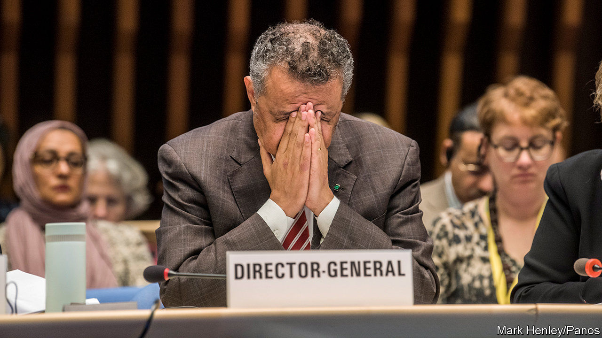

###### Global Health

# The World Health Organisation is under fire from America’s president 

##### Mostly, though, his charges are trumped up 

 

> Apr 16th 2020 

Editor’s note: The Economist is making some of its most important coverage of the covid-19 pandemic freely available to readers of The Economist Today, our daily newsletter. To receive it, register . For our coronavirus tracker and more coverage, see our 

DONALD TRUMP, America’s president, often acts as if he has never seen an international body that he likes the look of. The latest group in his cross-hairs is the World Health Organisation (WHO), together with its leader, Tedros Adhanom Ghebreyesus, a microbiologist who was once Ethiopia’s health minister. Mr Trump accuses the WHO of mismanaging the coronavirus pandemic currently sweeping the planet. As a consequence, he says, he will halt America’s payments to the WHO pending a formal investigation. Since America’s taxpayers stump up 15% of the WHO’s $4.5bn annual budget, that is no mean threat.

Critics such as Mr Trump are correct to observe that the WHO’s panjandrums have been obsequious towards China, the geographical source of the covid-19-causing virus, SARS-CoV-2. Dr Tedros himself has praised China’s president, Xi Jinping, for his “political leadership”. However, he has also praised Mr Trump for his “great work”. Such emollience is a consequence of the fact that only with the co-operation of its member countries can the WHO get on with its day job of acquiring data, weighing them up, and dispatching consequent advice and support around the world. This applies not only to unexpected epidemics like that now raging, but also to quotidian killers such as measles, malaria, HIV, tuberculosis, polio, diarrhoea, malnutrition, cancer and diabetes.


Doing that job well in the context of the epidemic involves providing information to member states on how the coronavirus can be contained, gathering evidence on which measures are effective and which not, and collecting data on everything from drug use to how doctors treat patients. The WHO also provides support for coronavirus -testing programmes, and advice about what tests should be used and how they should be executed, as well as helping to develop ways of testing the efficacy of tests. It is also co-ordinating research into, and trials of, drugs and vaccines against SARS-CoV-2.

Certainly, the organisation has flaws. It was, for example, criticised last year over its reluctance to declare an international public-health emergency during an outbreak of Ebola in the Democratic Republic of Congo (DRC), though it eventually gave way. Its response during and after an earlier outbreak of Ebola in west Africa in 2013 also led to criticism, though this was before Dr Tedros’s time. A report on the matter published in 2017 by the Royal Society, Britain’s top science academy, said that “while the WHO did offer some normative leadership during the Ebola outbreak, as per its constitution, it did not provide an effective operational response”. That criticism was, however, followed by the pertinent point: “yet nor did it have a mandate to do so.” Without the clear support of its members, the WHO cannot act.

When asked for fair criticisms of the WHO, David Heymann, of the London School of Hygiene and Tropical Medicine turns the question around, saying that what is actually remarkable is the rapidity with which an understanding of what is going on with SARS-CoV-2 has been developed, and that tensions between states have not halted the flow of technical information those states have provided. He said, for example, that on April 14th China’s Centre for Disease Control and Prevention had shared information with the WHO on the lockdown in their country, their unlocking strategies, what they are finding out about how to go about lifting lockdowns, and their general concerns regarding the matter of locking down.

Dr Tedros has been leading an attempt to reform the organisation, but this is hard. Because much of the money it receives is tied to member countries’ pet projects, it has little cash for other matters. When faced with an emergency such as covid-19 it must therefore raise funds on the hoof. It cannot, however, be faulted for lacking in foresight. Last year, when Dr Tedros was having trouble raising money for the response to the Ebola outbreak in DRC, he remarked that donors do not pay until there is “fear and panic”. The solution, he suggested, was more routine funding, to allow better preparation for epidemics. If only.■

Dig deeper:For our latest coverage of the covid-19 pandemic, register for The Economist Today, our daily , or visit our 

