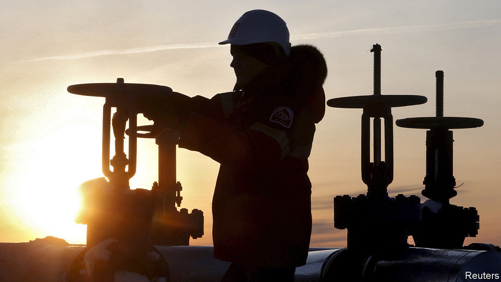
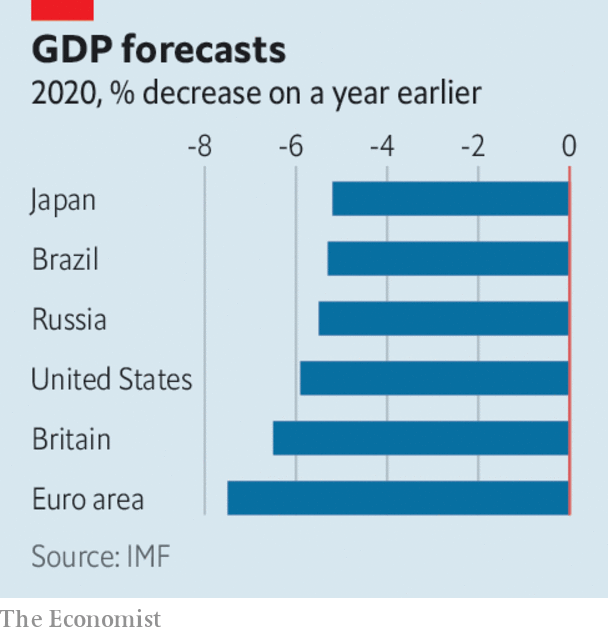

###### 

# Business this week 

#####  

 

> Apr 18th 2020 

Saudi Arabia and Russia ended their oil-price war, agreeing to a deal that will see oil-producing countries cut output by a record 9.7m barrels a day over the next two months, around 10% of global supply. There will be smaller cuts thereafter. The rally in oil markets that greeted the announcement soon faded, however. The International Energy Agency forecast that global demand for oil will fall by 9.3m barrels a day in 2020. This month “may go down as Black April in the history of the oil industry”, said the head of the agency. See .

 


In its direst warning yet about the effects of the pandemic, the IMF said that “the great lockdown” will result in the biggest economic downturn since the Depression. Assuming that covid-19 and restrictions on daily life peak in the second quarter, the fund thinks global GDP will shrink by 3% this year, although advanced economies are expected to contract by an average 6.1%. If the crisis does not ease in the second half the world economy could shrink by a further 3%. The fund urged countries to continue with measures to slow the spread of the disease so that economic activity can resume. See .


The Federal Reserve took more unprecedented measures to prop up the American economy, announcing a series of programmes that will provide $2.3trn in credit and support to households, businesses and state and local governments. The central bank is backing up to $600bn in loans to small and mid-sized firms, which must demonstrate a “reasonable effort” to retain staff. The Fed surprised markets by expanding its interventions to include buying stakes in exchange-traded funds that own risky, high-yield debt.

Irrational exuberance

Stockmarkets continued to swing wildly. The S&amp;P 500 had its best week since 1974 for the four days ending April 9th, rising by 12% (markets were closed on Good Friday).

At an emergency meeting South Africa’s central bank slashed its benchmark interest rate by another one percentage point, following a cut last month of the same size. The repo rate is now 4.25%, a record low. The move came after a further downgrade to credit ratings on South African debt, making it harder for the government to borrow.

The hard fall in China’s exports softened in March. Exports were down by 6.6% compared with the same month last year, much better than expected. China chalked up a trade surplus of $19.9bn, reversing the deficit of January and February, when factories were locked down. Many of those facilities have now reopened, though they face a squeeze from a global slump in consumer demand for their products.

China’s central bank took more steps to increase liquidity, pumping another 100bn yuan ($14bn) into the financial system ahead of the release of data expected to show the first quarterly contraction in GDP, year on year, since 1976.

The Asian Development Bank tripled the size of its aid package to member countries to $20bn. That includes some grants to governments to buy medical and personal protective equipment.

Retail sales in America fell by 8.7% in March compared with February, the biggest decline since the official run of data began three decades ago.

Releasing their first-quarter earnings, big banks in America revealed that they are putting billions aside to guard against an expected surge in loan defaults. JPMorgan Chase’s credit costs rose to $8.3bn in the quarter, for example, resulting in a sharp fall in net profit, to $2.9bn. See .

America’s biggest airlines said they had agreed to the terms of a $25bn bail-out from the government. Under the deal dividends will be suspended. American Airlines is to receive a direct grant of $4.1bn, a low-interest loan of $1.7bn, and will apply for a separate $4.8bn loan from the Treasury.

In response to the surge in online shopping Amazon is employing another 75,000 staff, on top of the 100,000 additional workers it hired recently. In Seattle Amazon sacked two activist employees for continuing to post claims on Twitter that conditions at its warehouses during the pandemic are unsafe. In France Amazon closed its warehouses for cleaning after a court said it should do more to protect staff.

Amazon’s share price hit new highs. It is up by a third since mid-March, giving the company a market value of $1.15trn.

Closing time

Forced to shut without much notice, Britain’s pub industry pondered what to do with an estimated 50m pints of beer lying undrunk in cellars. The rules have been relaxed on reclaiming tax for ullage, or wasted beer, so that the man from the brewery does not need to be present when it is disposed of, though social distancing is making it hard to lift the full kegs. With pubs closed, alcohol sales in supermarkets have soared.

