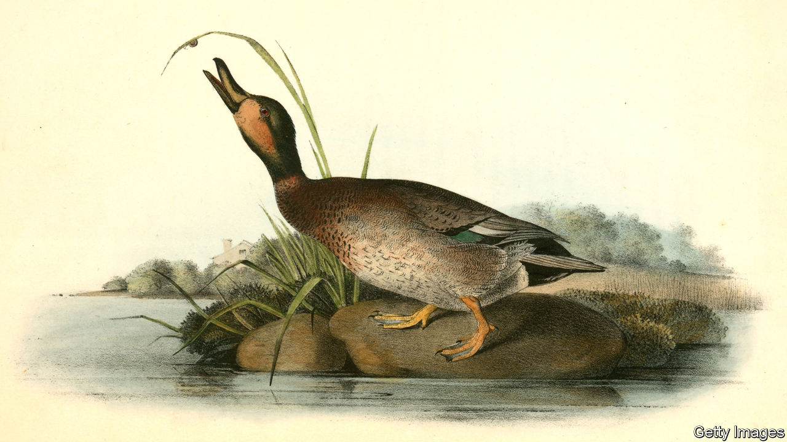

###### Home Entertainment

# Try painting in watercolours 

##### Above all a technique for the open air, it can be done just as well from a window 

 

> Apr 23rd 2020 

TO THOSE WHO spend their days working with pens and keyboards, a watercolour paintbrush can induce a faint anxiety. Its very lightness and delicacy suggests that great skill is needed to deploy it. Names of the master watercolourists rise troublingly to mind: Cotman for his wooded hills, Ravilious for his cliffscapes, Audubon for his birds. The amateur who merely wants to while away long hours can easily feel inadequate to the task. No matter, for even the attempt to paint in watercolour brings many rewards.

They begin with the pleasure of the materials themselves. The brush, of sable, which immediately conjures up some semi-mythical creature of the Russian forests. The cartridge paper, snowy, heavy and very slightly rough, better to hold the paint. A glass jar of water, quietly attendant. And then the paintbox. Possibly this is new, with the stout little colour-blocks lining up untouched, full of possibility. Or it may be old, full of histories of past outings: the viridian and cobalt blue deep-worn and depleted, the unloved cadmium red only a little dimpled, the inside lid a riot of try-outs for this exact shade, or that.


Watercolour often seems the poor cousin of more imposing oils. It can appear too fleeting and insubstantial or, alternatively, too flat and bright. But to paint in watercolour, even clumsily, is to find that it has two great virtues. On the one hand, being so quick to apply, it can catch the briefest passing effects of light, or water, or leaves. It has a transparency that glows even when dabbed on by not-very-expert hands. A small pad of cartridge paper can act as a notebook or a camera; a few strokes can record, with real force, one particular morning or the play of sunshine in one particular tree. And though it is above all a technique for the open air, it can be done just as well from a window.

In a state of social isolation, however, it is watercolour painting’s second virtue that comes into its own. When applied to a subject that is still, rather than constantly shifting—an apple, a cup, a stone—it becomes a deeply meditative practice. To describe a flower or a shell in words often fails, merely skating the surface. To try to paint it is to engage on an altogether different level: to look at structure and texture, to note the subtleties of colour and the effects of passing time, to feel its weight or weightlessness; to understand it. Gerard Manley Hopkins, a would-be painter as well as a poet, wrote of finding the inscape, the thisness of things. To focus on that is to begin to touch the heart of creation.

In this meditation the brush slows, and becomes careful. Colours and mixtures silently suggest themselves. Surplus paint curls down beautifully through the water. You do not need to be painstakingly accurate; too much care can kill the life and motion that dwell even in inanimate things. What matters is to look as a painter does, contemplatively, fully. You may well still feel you are no good at it, and you might tear up your effort afterwards, but almost certainly you will find that even failure is not a waste of time. ■

