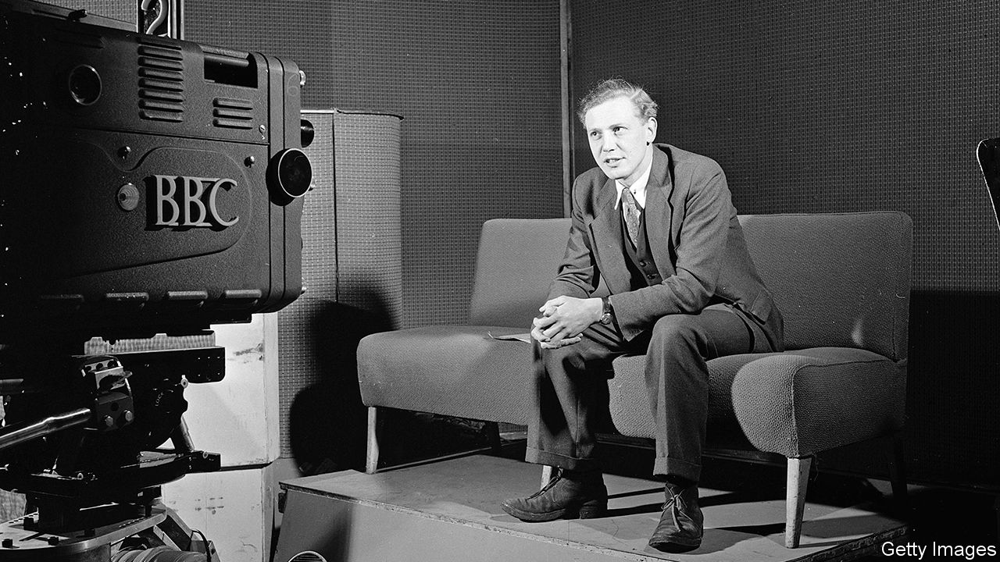
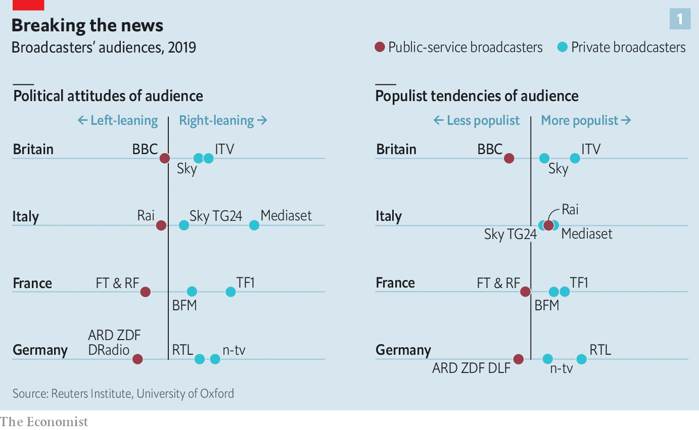
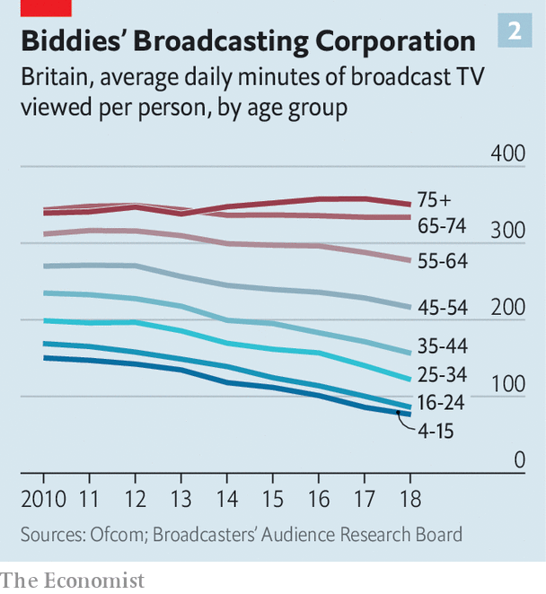

###### The next episode

# The BBC is having a good pandemic 

##### But the loss of young audiences poses a mortal threat to its funding 

 

> Apr 25th 2020 

Editor’s note: The Economist is making some of its most important coverage of the covid-19 pandemic freely available to readers of The Economist Today, our daily newsletter. To receive it, register . For our coronavirus tracker and more coverage, see our 

“HEY GANG, good morning! Hope you feel real good,” bellows Derrick Evans, marching on the spot in a dayglo spandex leotard. The 67-year-old fitness instructor, better known as Mr Motivator, has been brought out of retirement to help Britons stay trim during their covid confinement. As he pants through a slot on daytime television, he answers viewers’ questions. One couple say their heating has broken down and they are cold. “Get up now, and move the body!” he orders them.

As the country battles covid-19, the British Broadcasting Corporation has joined the war effort. Plans to lay off 450 of its journalists are on hold, as new programmes like “HealthCheck UK Live” (home of Mr Motivator) are rushed out. Its local radio stations are pitching in, one arranging the live-streaming of a funeral to the home of a quarantined relative. With public worship banned for the first time since 1208, the BBC is broadcasting virtual sermons. Bitesize, its educational arm, has roped in stars such as Sir David Attenborough to teach online lessons to home-schooled children, as the BBC food website highlights quick lunches for home-working parents. “As the national broadcaster, the BBC has a special role to play at this time of national need,” the corporation’s director-general, Lord Hall, declared after the outbreak.


The pandemic has given the BBC a potentially life-saving answer to a question asked with growing frustration in government: what is the point of the corporation? Two months ago a Downing Street source told the Sunday Times of plans to “whack” the 97-year-old broadcaster. Long-simmering resentment among Conservatives about what they see as its left-liberal bias had boiled over during the Brexit campaign of 2016 and the two general elections that followed. Tory complaints were amplified by allied newspapers—which have their own motives for attacking a rival that receives a subsidy of £3.6bn ($4.4bn) a year, courtesy of a £157.50 licence fee levied on households that watch live TV.

After winning his large majority in December Boris Johnson, who has dubbed the BBC the “Brexit Bashing Corporation”, set out plans to decriminalise licence-fee evasion, which the broadcaster says would cost it more than £200m a year. He has also leant on it to “cough up” and waive the fee for elderly viewers, which would cost it another £745m. (The BBC has agreed to let them off until at least August, during their quarantine.) Some senior Tories have even bigger designs on the corporation, whose 11-year royal charter is up for a mid-term review in two years. In January Julian Knight, who is chairing a parliamentary inquiry into the future of public-service broadcasting, called the licence fee “an anachronism in a world of choice”. In March Oliver Dowden, the culture secretary, warned that “the old model simply cannot sustain.”

So the covid crisis is helpfully timed. “There’s nothing like a situation like this to remind politicians of the value of the institution,” admits one senior BBC executive. Television viewership is up by a third since the outbreak, and the BBC’s 6pm news bulletin is reaching more than 20m people a week, nearly a third of the population. A broadcast by Mr Johnson last month was watched by 27m (the bulk via the BBC). The government has been forced to end its boycott of the “Today” radio programme, so that ministers can provide updates. Eight out of ten people say they are getting their news on covid-19 from the BBC, making it by far the most popular source. And its influence will only grow as a covid-related collapse in advertising hobbles commercial news outlets.

Amid the struggle against the virus, the corporation has slipped into something like wartime rules. Its website carries articles that gently reinforce public-health messages, such as an interview with a chastened 25-year-old entitled: “I thought because I was young it wouldn’t affect me.” (It very much did, he reveals.) Unofficial rules of engagement with interviewees have subtly loosened, to give subjects more breathing space. And there is a faint unwillingness to dwell on official missteps, of which there have been plenty. “The BBC does have a responsibility to provide what the nation needs,” says one senior journalist. “It needs to know what’s being done about testing [for covid-19]. It doesn’t need a great bust-up about what’s gone wrong in the recent past.” It is a fine balance, but “the bosses are keen that we come out of this with the sense that we looked after the interest of the nation, not just our journalistic values.”

This is uncomfortable. Yet the crisis has shown how a public broadcaster can help squash false stories. Mr Knight acknowledges the BBC’s role as “a bulwark against fake news”. Countries with public-service media have more hard news and better-informed populations than those without, according to a review of evidence by the Reuters Institute at the University of Oxford. Whereas 29% of Americans report seeing misleading news on covid-19, only 18% of Britons do. “I searched Netflix to see what public information it’s giving people during the crisis. Still searching…”, tweeted Nick Robinson, a “Today” presenter.

Yet even if the virus has averted a “whacking”, the BBC should worry about a slower-burning problem. The licence fee, in effect a near-universal tax, has endured on the basis that the corporation’s output is consumed near-universally too. As Lord Hall put it recently: “If you are paid for by everybody then you’ve got to give something to everyone.” But the BBC is finding that harder to do, for two reasons.

The first concerns the alleged bias in its output. The corporation is either “stacked full of right-wingers” (as a Guardian columnist complained) or so lefty that even its “Sherlock” detective drama contains anti-Tory messages (as claimed by the Daily Mail). Yet polling by the Reuters Institute finds that the BBC reaches an audience that is broadly in the middle of the political spectrum. This contrasts with its main commercial rivals, ITV and Sky, whose viewers lean to the right, and with public broadcasters in other countries, whose audiences usually lean left (see chart 1).

 


However, the question of bias has become harder to navigate. Digital technology has exposed audiences to new outlets like YouTube that are not required to follow impartiality rules. Unregulated online ranters should make the BBC look unbiased by comparison. But there is a danger that viewers draw the opposite conclusion: that everyone has a bias, and the BBC is merely concealing its own. In 2005 Michael Grade, the BBC’s then-chairman, predicted that “in the context of this new world of opinionated, value-laden broadcasting, the BBC [could] be perceived not as fundamentally different from other providers, but as fundamentally the same.”

Universal studios?

At the same time, the old left-right divide has been superseded by a cultural one that is harder for the BBC to bridge. Consider Brexit, the fiercest battle in this new culture war. Britain voted to Leave by 52% to 48%. But working-age graduates—ie, the BBC’s recruitment pool—backed Remain by two to one. In London they backed it by four to one. Mr Dowden, the culture secretary, has warned the broadcaster it must not project a “narrow, urban outlook”. It has beefed up its presence outside the capital, with a big base in Salford, in north-west England, and is hiring more non-graduate apprentices.

But the Reuters study found that on a “populism” spectrum, the BBC’s audience leant anti-populist. It struggles to reach the less-educated, who are 20% less likely than graduates to tune in to the BBC and little more than half as likely to consume its content online. “In our sensibilities, in our delicacies of speech, we are super-serving upper-middle-class people,” admits one well-known journalist. “The cultural battle isn’t made up by Dominic Cummings [the prime minister’s adviser]. It’s real.”

The second threat to the BBC’s universality is that young people are switching off. Whereas over-65s watch nearly six hours of live TV a day, the same as a decade ago, viewing among 16- to 24-year-olds has fallen by half, to just 85 minutes (see chart 2). Though they consume about four-and-a-half hours of video daily, the same as the average Briton, an explosion in new ways to watch has pulled them away from broadcast TV. More than half of households subscribe to a streaming service like Netflix, a figure that is rising under lockdown (see ). Those aged 16-24 spend more time on YouTube than live TV, according to Ofcom, the regulator. If that is worrying for BBC executives, the next generation should terrify them. Children aged 12-15 are more likely to have heard of Netflix than the BBC.

 


The risk to the BBC, like other old media companies, is that its “mode of delivery or style of content gets stuck with existing audiences and it fails to attract the young”, says Mark Thompson, who ran the corporation from 2004 to 2012 and is now chief executive of the New York Times. “It’s a challenge for the New York Times, The Economist, all of us—but it’s existential for the BBC because its funding is predicated on its ability to appeal to everyone, young as well as old,” he explains.

The widening gulf between older, richer audiences who spend half their waking hours consuming BBC content, and younger, poorer ones who seldom tune in, raises the question of whether it is fair that every household pays the same. One alternative would be to replace the flat fee with a progressive tax. In 2013 Finland swapped its licence fee of €252 ($275) per household for a tax of between zero and €140 per adult. The BBC dislikes this idea, fearing the erosion of its independence under the constant threat of tax cuts. But the licence fee itself has hardly been immune to political interference, rising steeply under Labour in 1997-2010 before falling hard under the Tories more recently.

Another option would be to make the BBC rely on advertising, like publicly owned Channel 4. Ad-supported public broadcasting is common in Europe. But the idea has few supporters in Britain. Letting the BBC run ads would suck revenue away from others—“like dropping a nuclear bomb on UK media,” shudders the head of one big media group.

The most radical proposal is to turn the BBC into a Netflix-esque subscription service, letting viewers opt out. This would be impossible with Britain’s current broadcast infrastructure, which has no “conditional access” capability. But in time more video and audio will be streamed by broadband. The BBC’s free iPlayer streaming app already requires users to sign in. It would just need to add a paywall.

That would be blasphemy at the BBC, whose first director-general, John Reith, rejoiced that “the same music rings as sweetly in mansion as in cottage.” Yet the corporation has privately looked into how subscription might work. A draft internal report in 2013, seen by The Economist, recommended a “‘divorce settlement’ with the state”, in which the licence fee would no longer be compulsory and the BBC would be free to charge viewers and raise finance in the markets. The proposal was rejected by Lord Hall and the report watered down.

The corporation has nonetheless gone on to experiment with some paid-for services. In 2017 in America, together with ITV, it launched BritBox, which for $6.99 a month offers streaming access to both channels’ back catalogues. BritBox has since opened in Canada and Britain; Australia is next. Channel 4 joined this month. With 1m subscribers in North America, it has a lot of ground to catch up with Netflix, which has 70m. For the BBC and ITV this is galling: they proposed a similar venture in 2009, when Netflix was still sending out DVDs by post, but British antitrust regulators vetoed it, fearing it would limit competition. Today that looks like a mistake.

Lord Hall will depart in the summer. Though he steadied the ship after the disastrous 54-day tenure of George Entwistle, the consensus is that his successor must take more risks. They will need political nous to deal with frustrated Tories, administrative skill to manage more than 20,000 staff and journalistic experience to make the daily editorial judgments that amount to “whether you have shit cover your ankles, knees, waist or head”, as one former decision-maker puts it. Tim Davie, the boss of BBC Studios; Alex Mahon, who runs Channel 4; and Charlotte Moore, the BBC’s head of content, are among those tipped. The hostile political environment has put some candidates off, and the £450,000 salary is not high by industry standards, remarks an executive at another channel. “But,” he concedes, “it’s a big train set”. ■

For our latest coverage of the covid-19 pandemic, register for , our daily , or visit our 

