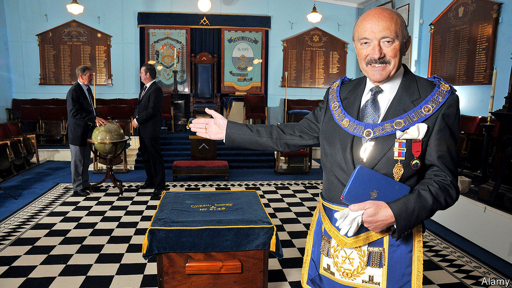

###### Out of the shadows

# The freemasons want to be known for hand wash, not handshakes 

##### Covid-19 offers a chance for some good publicity 

 

> Apr 25th 2020 

Editor’s note: The Economist is making some of its most important coverage of the covid-19 pandemic freely available to readers of The Economist Today, our daily newsletter. To receive it, register . For our coronavirus tracker and more coverage, see our 

THE FREEMASONS, a centuries-old network of fraternal lodges, have long provided fodder for thriller writers and folk with overactive imaginations. Suggestions of conspiracy range from the outlandish to the banal. Steve White, a former chairman of the Police Federation, a cops’ union, claimed they blocked reforms to the service. Masons roll their eyes at such claims. “There is ‘The Da Vinci Code’ and the keyboard warriors going crazy,” sighs Matt Felgate, a freemason from Lincolnshire’s Provincial Grand Lodge. “But much to my disappointment, it’s mainly about making yourself a better person.”

Covid-19 gives Mr Felgate and his fellow masons the chance to step into the limelight, and demonstrate another side to their institution. He has transformed his gin distillery into a factory pumping out hand sanitiser. Masons in Scunthorpe have made more than 1,000 facemasks for carers. Other lodges have bought thousands of masks from China or are lending nurses their car parks. For once, being able to call in favours from a network of contacts seems positively altruistic. In Belfast masons managed to find some 3,000 packs of loo roll. “I got together with someone I knew who owned a toilet-roll factory,” says Leslie Weir of the local lodge. “It’s just nice to be seen. We may have some secrets but it’s not a secret society.”


Masons emphasise that such charitable efforts are nothing new. Indeed, they claim their brotherhood is the second-biggest institutional donor in Britain. As well as being a good in itself, such public acts of philanthropy help to counter the brotherhood’s reputation for secrecy. David Staples, chief executive of the United Grand Lodge of England, the lodges’ governing body, says dispelling the public’s misconceptions about freemasons is a priority.

That includes dismissing the idea that the organisation is set on advancing an agenda. “We’ve got trade-union leaders right through to captains of industry,” he points out. “I wouldn’t have a clue what our members’ political leanings are.” He nevertheless hopes that their efforts during the current crisis will be rewarded by a boom in initiations—including, perhaps, your correspondent. “When all this is over, please do come and visit us,” he urges.

Dig deeper:For our latest coverage of the covid-19 pandemic, register for The Economist Today, our daily , or visit our 

