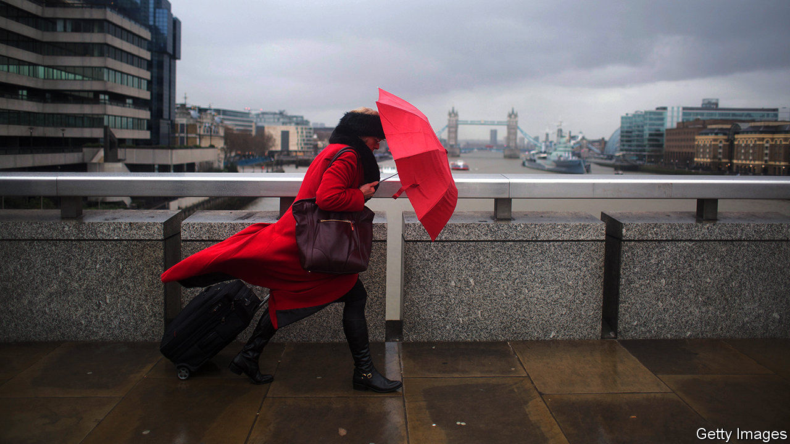

###### Under the weather

# How risk-parity investment strategies unravelled 

##### The value of portfolios plunged when bond and stock prices began to move in tandem 

 

> Apr 25th 2020 

Editor’s note: The Economist is making some of its most important coverage of the covid-19 pandemic freely available to readers of The Economist Today, our daily newsletter. To receive it, register . For our coronavirus tracker and more coverage, see our 

“THE PANDEMIC was a strange beast that I didn’t have an edge wrestling with,” says Ray Dalio, founder of Bridgewater Associates, the world’s largest hedge fund, explaining his losses in the first quarter. For years Bridgewater’s famed risk-parity strategy produced high returns for low risk, and was widely adopted by others. But things soured when covid-19 hit. Mr Dalio reported losses of 7-21% across his funds in the first quarter, his biggest since late 2008.

Bridgewater created the first risk-parity portfolio in 1996, when it launched its All Weather fund. It was intended to be insulated from market-wide shocks. A typical way to do this is to balance holdings of relatively volatile stocks with government bonds—in times of market stress bonds usually rise in value, offsetting losses from stocks. But that means less exposure to equities, which tend to have higher returns. Bridgewater’s innovation was to keep a high allocation of stocks, but to borrow to buy safe long-dated bonds. If the long-dated interest rate is higher than the borrowing rate, as has generally been the case, this raises the total return on the portfolio, without adding extra risk.


The strategy’s success led others to follow. Assets allocated to the strategy probably exceeded $1trn in March, according to David Zervos of Jefferies, an investment bank. Risk parity’s outperformance during the global financial crisis was its making. The average annual return in the S&amp;P risk-parity index in 2006-10 was 8%; by contrast, the S&amp;P 500 equity index made nothing.

At first risk parity fared well during the corona-crisis. Between January 1st and March 13th the MSCI world share-price index fell by 20%. Safe assets were in high demand. In America the yield on the ten-year Treasury, which moves inversely to the price, dipped to a record low of 0.3% on March 9th. But then bond and share prices began to fall in tandem. Faced with an intense cash crunch, some investors sold their holdings of even liquid assets such as Treasuries. Risk-parity portfolios plunged in value.

With yields on Treasuries still low, proponents of risk parity are on the lookout for other ways to hedge risk. Mr Dalio reckons that government borrowing undertaken to support the economy during the pandemic will stoke inflation, making bonds less attractive to hold. Mr Zervos argues that investment-grade corporate bonds, which offer a return that is around two percentage points higher than government bonds, could be a substitute. The search for a new way to outperform begins.

Dig deeper:For our latest coverage of the covid-19 pandemic, register for The Economist Today, our daily , or visit our 

