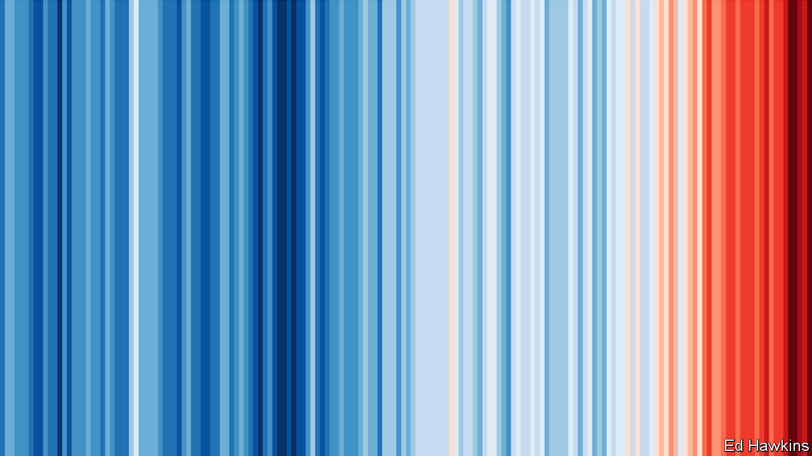

###### An Earth Day in the life of a plague

# Covid-19 and the climate 

##### The pandemic should neither distract people from action on climate change nor confuse them about it 

 

> Apr 25th 2020 

APRIL 22ND WAS doubly disrupted. If it had not been messed up by the covid-19 pandemic, as all days now are, parts of it would have been brought to a halt by activism about the climate. This was the 50th anniversary of the first Earth Day, a festival of demonstrations, marches and teach-ins that took place mostly in America and is widely seen as marking the birth of modern environmentalism. Organisers had hoped that this year’s would see hundreds of millions take to the streets around the world. A huge school strike of the sort pioneered by Greta Thunberg, a Swedish activist, was planned, as well as who-knows-what by way of direct action. A new generation of environmental activists intended to demand a better future more loudly than ever.

The pandemic means that this widespread and co-ordinated youthful passion, one of the most striking developments in recent climate politics, is instead being expressed indoors and online. This in itself will inevitably lead some to contemplate how climate change and covid-19 fit together. One of the slogans of the first Earth Day was what the pioneering environmentalist Barry Commoner called “The first law of Ecology”—that “Everything Is Connected With Everything Else”.


Both scourges bear this out. Some 200,000 deathbeds in 170 countries have been connected by an unbroken web of viral spread. So have bat caves in China and test tubes in California, as well as silent airports, deserted shops and crowded food banks all across the planet. The connections which underlie climate change are even more pervasive. They tie together almost all the 21st century’s means of transport, manufacture and growth, its buried geological past and its melting Arctic ice. The workings of the great round world, as revealed by pictures of the blue-white filigreed Earth from space that were so inspirational in 1970, really do link all its components.

Covid-19 and climate change are both global problems, and proper responses to both require levels of co-operation that the countries of the world find hard. Responses to the effects of covid-19 on the coal industry, among others, or to the need for economic stimulus once the virus has abated, will offer opportunities to further or impede decarbonisation. And both have their origin in a strange mixture of human action and the unbiddable, indifferent forces of nature, provoking contradictory feelings of culpability and a complete lack of control.

Connectedness, though, is no excuse for sloppy thinking. The two scourges are not usefully treated as the same problem—of excessive economic growth clogging the sky as it encroaches on the wildernesses where new pathogens lurk. There is no single rethinking or rejection of the way humans live today that will solve both. Nor is the pandemic a response to environmental degradation. To hear sweet birds singing in the streets of Vancouver as fish swim the unsilted canals of Venice and goats throng the streets of north Wales lifts locked-down spirits. But the pandemic is not, as some say, “nature’s reset”. Such thinking easily slips into the misanthropy that can lead environmentalists to see people themselves as the problem.

To help readers appreciate each challenge for what it is, this week our newspaper, full of covid-19 news, makes room for the first of a series of six climate briefs. We begin by looking at the politics of climate change. Later themes will include climate science, carbon cycles and the energy transition. When they started in the 1970s, “Schools briefs” were intended as primers for students; this year they will be more along the lines of “Home-school briefs”. We hope they will help all generations seized with the importance of climate change—and not just Ms Thunberg’s—to further their understanding of what lies ahead.■

