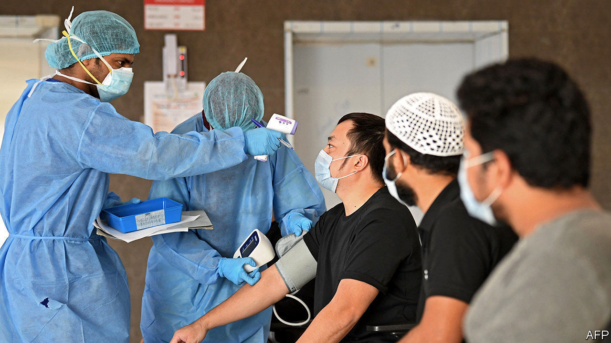

###### Essential workers

# The Gulf states should take better care of their migrant workers 

##### It is not only humane, it is practical 

 

> Apr 25th 2020 

Editor’s note: The Economist is making some of its most important coverage of the covid-19 pandemic freely available to readers of The Economist Today, our daily newsletter. To receive it, register . For our coronavirus tracker and more coverage, see our 

LIFE HAS never been easy for the Gulf’s migrant workers. Though they are around half of the region’s population and are essential to its economy, the locals give them little respect. Coming from poorer countries such as India, Pakistan and Nepal, most work long hours for wages that are high compared with salaries back home but low by any other standard. They care for Kuwaiti children, nurse sick Saudis and build Dubai’s skyscrapers. When their workday is done, many are crammed into spartan dormitories by their employers. Whether visiting workers have lived in the Gulf for two months or two decades, they are deemed to be “temporary” and are left out of the social contract. Most citizens treat them as a subservient underclass.

The outbreak of covid-19 has made life even harder for migrants, who probably account for most of the recorded infections in the Gulf and are also bearing the brunt of the economic fallout. Many are locked down, out of work and unable to go home because of restrictions on travel (see ). Some struggle to afford food. Governments should take better care of them. That is not only humane, it is also practical. If the Gulf states do not start treating their guests with more compassion, they are likely to find that their outbreaks last longer and that their economies recover more slowly.


So far, the pandemic has revealed more bigotry than benevolence. An MP in Kuwait wants to “purify” the country of illegal workers. “Put them in the desert,” says a famous Kuwaiti actress. A viral video in Bahrain featured a man complaining of migrants being treated next to citizens—never mind that half the nurses in Bahrain come from abroad. In hospitals across the region foreigners are on the front line fighting the virus.

Discrimination is bad enough, but the dormitories where migrants live are incubators for covid-19. With four or more to a room, there is no space for social distancing. At a big labour camp in Qatar one infection quickly became hundreds. Far from the Gulf, Singapore, which treats migrant workers somewhat better, thought it had the virus under control until it broke out in their dormitories. Now infections are rising fast and the authorities have had to extend restrictions on work and travel.

Neglecting migrants hurts citizens, too. The dormitory outbreaks stand a good chance of spreading to the permanent population, lengthening lockdowns. Xenophobes see this as yet another reason to banish foreigners. But countries such as India, which have their hands full, are not co-operating with efforts to return their jobless, potentially ailing expatriates.

The Gulf states are at last taking steps to stem the virus in migrant areas. Some have launched mass-screening and are testing those with symptoms. Temporary housing has been set up to allow social distancing. Most countries are treating covid-19 patients, including migrants, without charging them. Saudi Arabia has also released dozens of migrants held for minor immigration offences, so that prisons do not become plague factories. The United Arab Emirates is automatically renewing the paperwork for migrant workers so that they don’t find themselves on the wrong side of the law just because they are locked down.

That is all to the good, but more needs to be done. Some migrants are still working—building stadiums for the World Cup in 2022 or facilities for the World Expo next year. Employers should be held accountable for their safety. Many migrants cannot work, though, and states should care for them, too. Gulf countries can afford to guarantee a portion of their wages during the outbreak. That will not only ensure that they do not go hungry—it will mean that someone is there to turn the lights back on when businesses start to open up again. ■

Dig deeper:For our latest coverage of the covid-19 pandemic, register for The Economist Today, our daily , or visit our 

