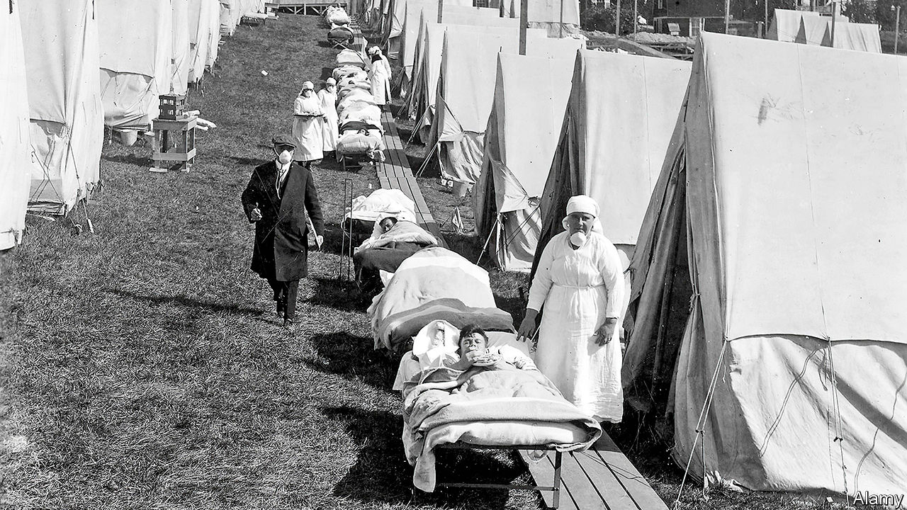

###### Pandemics past and present

# A peculiarity of Spanish flu may shed light on covid-19 

##### Age-related mortality is not always what might be expected 

 

> Apr 25th 2020 

Editor’s note: The Economist is making some of its most important coverage of the covid-19 pandemic freely available to readers of The Economist Today, our daily newsletter. To receive it, register . For our coronavirus tracker and more coverage, see our 

IT IS NOW well established that developing the symptoms of covid-19 when you are old is extremely dangerous, but not so risky when you are young. That might seem unremarkable. Old people are less resilient, and more likely to have specific confounding health problems like diabetes. However, this pattern—that the young live through infection while the old die—is by no means the norm. The influenza outbreak of 1918-19, known (unfairly to Spaniards) as the “Spanish” flu, for example, proved particularly harmful to those aged between 20 and 40, and thus apparently in their prime. Some suspect that fact may cast light on the, albeit different, age-related susceptibility to covid-19.

One suggestion to explain what happened in 1918 is that those older than 40 tended to survive because they had acquired protective immunity from an earlier round of influenza to which younger generations had not been exposed. A second is that the more potent immune systems of the young overreacted to the 1918 virus for some reason, and that this triggered in them a cataclysmic, frequently fatal, immune response known as a cytokine storm. (Cytokine storms, as it happens, are sometimes a cause of death in cases of covid-19.)


Alain Gagnon, a demographer at the University of Montreal, in Canada, has been studying the matter for several years. It was he who spotted, in 2013, that within the two-decade cohort of susceptible individuals in 1918 there was a particular spike in mortality among those exactly 28 years old. Even members of the cohort younger or older than this did considerably better.

Working with a team of immunologists, microbiologists and infectious-disease experts, Dr Gagnon pointed out that cytokine storms were unlikely to be solely responsible for this spike, since the immune systems of 28-year-olds are just as likely to overreact in such a manner as those of 20-year-olds. He also argued that the notion of older generations having developed immunity through exposure to earlier viruses does not hold up, since this, too, would have left those under 28 just as vulnerable as 28-year-olds.

Instead of these ideas Dr Gagnon and his colleagues support an alternative hypothesis, developed by Dennis Shanks of the Australian Army Malaria Institute, in Queensland, and John Brundage of the Armed Forces Health Surveillance Centre, in Maryland. This is that, in some circumstances, early exposure to a virus can harm subsequent immune responses rather than helping them.

Learning the wrong lesson

Dr Shanks and Dr Brundage observed that in 1890, the birth year of those who were 28 in 1918, a different and less lethal strain of influenza, known as Russian flu, spread around the world. They also knew from experiments on pigs, conducted by others, that exposure to one virus during early life has the potential to make infections of other, quite different, viruses later on much more severe than they otherwise would have been. Based on these observations they argued that the immune systems of those exposed to Russian flu as newborn babies—a period of life when immune systems are especially attuned to learning about which pathogens are circulating—learnt about Russian flu all too well. As a consequence, when faced 28 years later with Spanish flu viruses they mounted the wrong response (ie, to Russian flu rather than to the real threat).

Nor is the example of 1918 unique. According to Dr Gagnon, people who were themselves born during that epidemic showed increased vulnerability to the Hong Kong flu of 1968. And those born during the Asian flu of 1957 showed higher mortality in the face of swine flu in 2009. He therefore wonders if something similar is going on now, with elderly people mounting inappropriate immune responses that reflect the infections of their youth. Since all of his examples relate to influenza viruses, which are different beasts from coronaviruses, this is speculation. But it is a line of inquiry that might be worth following once the immediate crisis is over.■

Dig deeper:For our latest coverage of the covid-19 pandemic, register for The Economist Today, our daily , or visit our 

