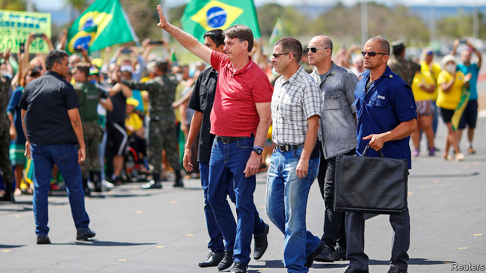
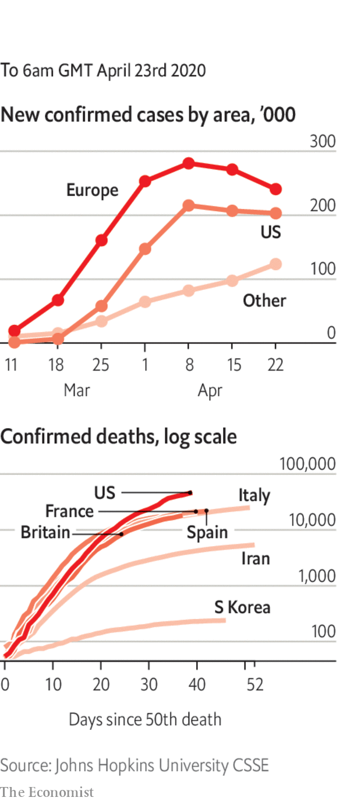

###### 

# Politics this week 

#####  

 

> Apr 25th 2020 

Brazil’s president, Jair Bolsonaro, who has dismissed covid-19 as “sniffles”, spoke outside the army’s headquarters at a rally against lockdowns. Some of the protesters called for a shutdown of Congress and the Supreme Court and urged the army to take control of the pandemic response. Mr Bolsonaro has said: “Really, I am the constitution.” He also sacked a health minister who supported lockdowns and replaced him with one who favours a return to business-as-usual “as quickly as possible”. 

Sporadic protests broke out in several American state capitals against lockdown measures. Some states took steps to reopen businesses. Georgia’s governor went as far as allowing cinemas and restaurants to resume service from April 27th, subject to social-distancing rules. President Donald Trump said he disagreed with this “totally egregious” decision. See .

Spain followed France and Britain in extending its lockdown, the toughest in Europe, until at least May 9th. However, it slightly relaxed the rules, so that people can leave home for brief exercise.

A man dressed as a royal Canadian mounted policeman murdered at least 22 people in a shooting spree in Nova Scotia. The killer was a denture-maker said to be obsessed with the federal police. A member of that force eventually killed him. It was the worst mass shooting in Canada’s history.

Argentina’s government asked creditors to accept big losses in the value of the bonds they hold. It proposed that those who hold $65bn-worth of paper, nearly 40% of foreign-currency debt, accept sharply lower interest payments and wait three years to receive them. The plan was rejected. See .

China tightened controls on movement in the north-eastern city of Harbin, the capital of Heilongjiang province, to keep covid-19 in check. Heilongjiang borders Russia, where the disease appears far more rampant than in China.

China announced the establishment of two districts within a municipality that it says has jurisdiction over the South China Sea. The districts are called Xisha and Nansha, the Chinese words for the Paracel and the Spratly islands. Vietnam, which also claims the Paracels, expressed outrage.

Police in Hong Kong arrested 15 well-known pro-democracy activists. China blew a hole in Hong Kong’s Basic Law, a mini-constitution that protects Hong Kongers’ freedoms. Its Liaison Office in Hong Kong said it was not bound by a provision that bars the mainland’s government departments from interfering in Hong Kong’s affairs. See .

Kim Jong Un, North Korea’s dictator, missed an annual ceremony to commemorate the birthday of his grandfather, who was North Korea’s first president, prompting speculation that he is ill.

Data on burials suggested that there have been many more deaths from covid-19 in Jakarta, Indonesia’s capital, than have been officially recorded. The Indonesian government reversed itself and banned migrant workers from returning to their home villages to celebrate the end of Ramadan in May. It fears the massive annual migration would accelerate the spread of the disease across the archipelago.

After three elections in a year, Israel at last has a new government. Binyamin Netanyahu, the prime minister, made a deal with Benny Gantz, the former opposition leader, which will see Mr Netanyahu stay in office for 18 months. Then Mr Gantz will take over. Both men were under pressure to avoid another election and co-operate to tackle covid-19. See .

Donald Trump told the American navy to “shoot down [sic] and destroy any and all Iranian gunboats if they harass our ships at sea.” America recently reported that 11 vessels from Iran’s Revolutionary Guards Corps came close to American ships in what it described as “dangerous” manoeuvres.

Reports emerged of a massacre by jihadist rebels in northern Mozambique. Dozens of villagers were shot or beheaded after refusing to join the group. The insurgents have reportedly also killed 20-30 members of the security forces.

The UN warned that millions of people in Africa face an increased risk of famine because of the economic dislocation caused by covid-19. Many were already in need of food or cash aid because of drought in places such as Zimbabwe and locusts in Kenya. See .

Donald Trump suspended for at least 60 days the provision of green cards to people who are immigrating legally to the United States. He said he was doing this to protect American workers from foreign competition during the crisis, but he backed away from stopping visas for guest workers after businesses complained that they would suffer.

NASA set May 27th as the date for the first launch of “American astronauts on American rockets from American soil” since the end of the space- shuttle programme. The vessel has been built by Space X, one of Elon Musk’s companies. Since 2011 Americans travelling to the International Space Station have had to hitch a ride on Russian rockets.

Coronavirus briefs

 


Officials in Wuhan, the Chinese city where covid-19 was first detected, raised the death toll there by 50%, to 3,869. The true extent of the outbreak in China remains unclear.

Having thought it had contained the spread of the disease, Singapore reported a spike in infections, mostly among migrant workers.

The port city of Guayaquil, Ecuador’s commercial hub, was overwhelmed with deaths from covid-19. Many corpses have been left in the streets.

Chile said it would issue immunity cards to people who have recovered.

Nearly 1,100 sailors aboard the Charles de Gaulle, a French aircraft-carrier, tested positive.

The German state of Bavaria cancelled the Oktoberfest beer festival. The mayor of Munich supported the decision, but said it was still a bitter blow.

