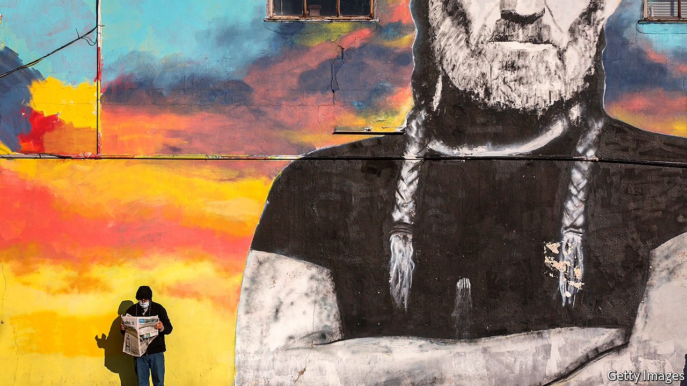
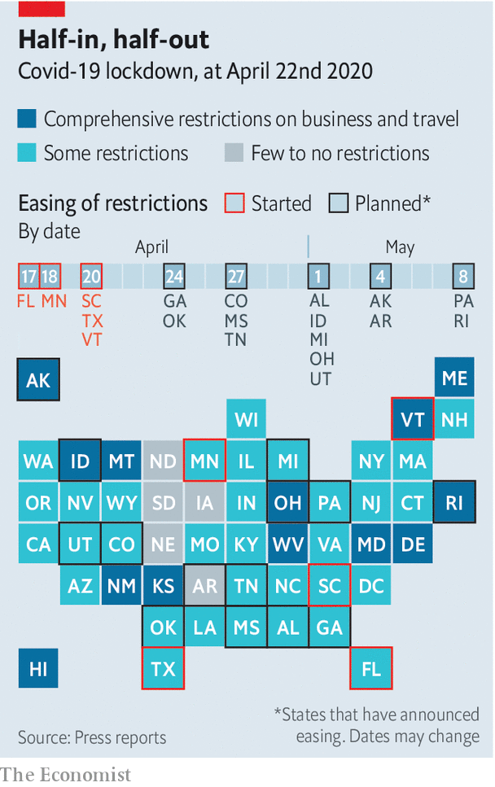

###### Stir-craziness

# America begins easing restrictions 

##### The country is adopting a half-in, half-out approach to lockdowns 

 

> Apr 23rd 2020 

Editor’s note: The Economist is making some of its most important coverage of the covid-19 pandemic freely available to readers of The Economist Today, our daily newsletter. To receive it, register . For our coronavirus tracker and more coverage, see our 

“WE ARE starting our life again,” said President Donald Trump on April 16th, as he unveiled the federal government’s plan to reopen America. The next day Greg Abbott, Texas’s governor, echoed the president’s optimism. “We have demonstrated that we can corral the coronavirus,” he said. (That same day Texas reported 916 new covid-19 cases, roughly in line with the previous week.) Mr Abbott is gradually reopening his state; his stay-at-home order will expire on April 30th.

Other Republican governors have followed suit. South Carolinians returned to beaches and shops this week. Georgia’s governor planned to let barbershops, hair salons and gyms reopen by April 24th, with restaurants and cinemas opening the Monday after. Bill Lee, Tennessee’s governor, will let his stay-at-home order expire on April 30th. They are all models of prudence compared with Ron DeSantis, Florida’s governor, who deemed pro wrestling an “essential business” and allowed beaches to fill with crowds. Democratic and independent minded Republican governors, meanwhile, have been more circumspect.


The point of the lockdown was to accept short-term economic pain as the price of getting the virus under control. Ideally it would ease once the country brought its infection rate down, and prepared itself—through widespread testing, an army of contact-tracers and infrastructure to support extended isolation and quarantine—to box in future outbreaks. America currently has none of the above. And, because viruses and people can easily cross state lines, an America in which Democratic governors keep citizens at home while Republicans do not risks the worst of both worlds: poorly controlled spread requiring repeated future lockdowns, which extend economic pain and uncertainty.

The handmaiden of eagerness is partially justified optimism. Just one month ago an epidemiological model warned that covid-19 could kill 2.2m Americans. Mr Trump has said that keeping American deaths under 200,000 would constitute “a very good job.” Thus far about 47,000 have died. Some hotspots have begun bringing the disease to heel. There seem to be fewer sirens screaming towards Elmhurst Hospital in Queens, the centre of New York’s outbreak. On April 20th the state reported its fewest new cases in a month, and the death toll was below 500 for the first time in weeks. A Gallup poll showed that the share of Americans who think things are improving rose between early and late April.

But these developments testify to the success of social distancing. Abandoning it now risks being like throwing away an umbrella in a rainstorm because it has stopped its bearer from getting soaked—particularly because America seems unprepared for the next stage of the fight. A recent report from Harvard’s Safra Centre for Ethics suggests that to safely and fully reopen, America needs 5m tests per day by early June—six weeks from now—and 20m by late July. That figure would let local health authorities swiftly catch and isolate asymptomatic transmitters whose jobs put them in contact with vulnerable populations—nursing-home or health-care workers, for instance—or who cannot isolate themselves (people in jails and prisons). Ashish Jha, who heads Harvard’s Global Health Institute, argues that 500,000 tests per day is an acceptable minimum.

Throughout April the number of daily tests has averaged around 150,000, with the share of positive tests staying around 20%. That suggests America is testing only people who are probably infected (in Taiwan, for instance, one in every 132 tests is positive), which in turn suggests that many mild or asymptomatic cases are going undetected. America may have 15 to 20 times more actual infected people than confirmed cases. Material shortages and laboratory backlogs, not helped by a lack of co-ordination and sharply increased demand, have hampered America’s testing capacity. Mr Trump’s repeated reassurance that anyone who wants a test can get one seems to have stopped firms from making tests in sufficient quantity (everyone assumed someone else was doing it). Those problems seem solvable, but only with decisive, concerted federal action.

America also has a shortage of contact-tracers—people who investigate where someone caught the disease and who else he may have infected. Tom Frieden, who headed the Centres for Disease Control (CDC) until 2017, believes America needs 300,000. It currently has around 2,200. Some states and cities have begun training more, but not nearly enough (Wuhan alone had 9,000). America also lacks places to isolate the infected so they do not spread the virus to their families and neighbours.

 


Indeed, the federal government’s own guidelines suggest that before a state reopens, it should see a declining number of covid-19 cases and positive tests over 14 days, and have in place a “robust testing programme”—criteria that none of the reopening states satisfies. Yet throughout the pandemic Mr Trump has played both sides: appearing onstage nightly with public-health experts and chastising Georgia’s governor for reopening too soon, while also encouraging anti-lockdown protesters on Twitter; claiming “total” authority while also saying, “I don’t take responsibility at all.” He seems to want to reap any public-health gains from the lockdown while forcing governors to accept culpability for any economic hardship.

Perhaps the opening southern states will suffer no ill effects. Some lifting of restrictions make sense—Texas has opened some state parks, for instance, but only for daytime use, and visitors must make reservations, wear masks and not gather in groups of more than five people. South Carolina’s governor requires shops to admit no more than five people per 1,000 square feet, and follow CDC sanitation practices. Perhaps the virus will fade in warm weather, or mutate to become less dangerous. But, as Mr Frieden says, “it will be a trial-and-error experiment, and the errors can result in lost lives” (see ).

Should that happen—should Texans and Georgians fall ill and look balefully northward, or blame their Trump-aligned governors—Mr Trump has pre-emptively found a scapegoat. On April 20th he announced, “In light of the attack from the Invisible Enemy...I will be signing an Executive Order to temporarily suspend immigration into the United States!” In practice this will not change much. With visa-processing at embassies suspended, the northern and southern borders shut to non-essential travel and court dates for asylum-seekers postponed, immigration has already slowed to a trickle. Court challenges will start before Mr Trump’s signature on the executive order is dry.

Keeping immigrants out will not make the country healthier. Although immigrants comprise 14% of America’s population, they account for nearly 30% of its doctors. Yet the president is arguing in a different register. He may not be able to control the virus, but he has more power to choose the territory where the election is fought. Natives versus foreigners worked well in the past—why not try it again?■

Dig deeper:For our latest coverage of the covid-19 pandemic, register for The Economist Today, our daily , or visit our 

