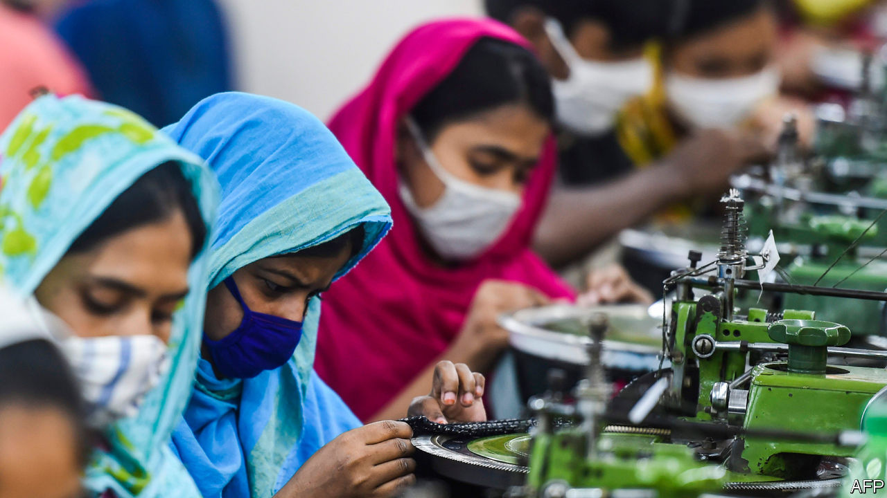

###### Suffering from a stitch

# Bangladesh cannot afford to close its garment factories 

##### But keeping them open seems like a terrible idea, too 

 

> May 2nd 2020 

Editor’s note: The Economist is making some of its most important coverage of the covid-19 pandemic freely available to readers of The Economist Today, our daily newsletter. To receive it, register . For our coronavirus tracker and more coverage, see our 

THE BANGLADESHI version of lockdown, observes Rumi, a garment-worker, is quite ruthless: “Police and soldiers beat up people, rickshaw pullers and street vendors, anyone who comes out onto the street.” But when it comes to garment factories (and mosques—see ) the authorities equivocate.

The factories’ 4.1m workers, who both live and labour in cramped conditions, are particularly vulnerable to covid-19. Yet the garment industry, which brought in $34bn in export revenue last year, accounts for 13% of GDP and has driven the country’s impressive growth over the past few decades.


The government first tried to fight the coronavirus through a prolonged public holiday. When it became clear that would not be enough, it ordered businesses to close on March 31st. Conspicuously omitted from the lockdown, however, were the garment factories, which are concentrated in and around Dhaka, the capital. Four days later a directive ordered them to close, too, but not before the workers, many of whom had gone to their home villages for the holiday, had returned at the urging of factory-owners. Hundreds of thousands travelled back and forth, says Kalpona Akter, a labour activist, many on foot.

The workers were then left languishing in slums by the garment factories—now the centres of Bangladesh’s coronavirus outbreak. Out of work and hungry, thousands have ignored the legions of baton-wielding police and soldiers to protest about unpaid wages. The government has promised $590m in cheap loans to allow factories to pay wages, but owners are still waiting for the central bank to dole out the funds. The government says 150,000 workers have not been paid for March. It is more like 200,000, says Ms Akter.

Faced with what Rubana Huq, president of the Bangladesh Garment Manufacturers and Exporters Association (BGMEA), calls a “brutal dilemma” of “lives versus livelihoods”, authorities have instructed factories to get back to work. Around 2,000 reopened this week, with hundreds more set to open in stages in the next few days.

Even though demand for clothes has plummeted in much of the world because of the coronavirus, many factory owners feel they cannot afford to remain closed. The fact that some $3.5bn of orders have been cancelled makes them even more eager to fulfil the few jobs that remain. Some online retailers are still buying, and demand may revive as lockdowns ease in parts of Europe and America.

Rival garment factories in Cambodia, China, Sri Lanka and Vietnam have already reopened, says Syed Naved Hussain of Beximco Textiles, which employs 40,000 people and sells to big Western retailers such as Walmart and Zara. If Bangladeshi suppliers remain on lockdown, he fears, customers may start to shop elsewhere.

BGMEA has issued guidelines to protect workers. As well as advising preventive measures such as wearing masks, washing hands and keeping employees well spaced, Ms Huq is trying to broker deals with hospitals to make sure that the garment-workers who catch covid-19 get treatment.

But good health care is in short supply. Bangladesh has 170m people but fewer than 2,000 ventilators and around 1,000 intensive-care beds. It has reported 7,100 coronavirus cases so far, but the number is rising fast despite limited testing. The disease seems to be spreading most rapidly in the very districts where garment factories are clustered. In one such area, Narayanganj, 150 out of 160 tests conducted one day this week proved positive.

Some factories, having already suffered a financial blow from cancelled orders, are trying to cut costs by flouting the rules designed to curb the disease. The one in which Rumi works in Gazipur, another covid-19 hotspot, has stayed open throughout lockdown, despite the government’s changing directives. Eight of her colleagues have died. She says that BGMEA told her bosses to hand out gloves, but they seem to have kept them for themselves. “Why aren’t we given gloves too?” Rumi asks. “Our lives are worth less, it seems.” ■

Dig deeper:For our latest coverage of the covid-19 pandemic, register for The Economist Today, our daily , or visit our 

