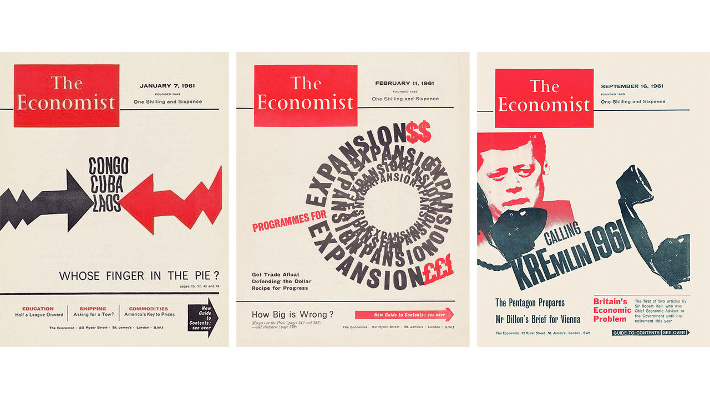
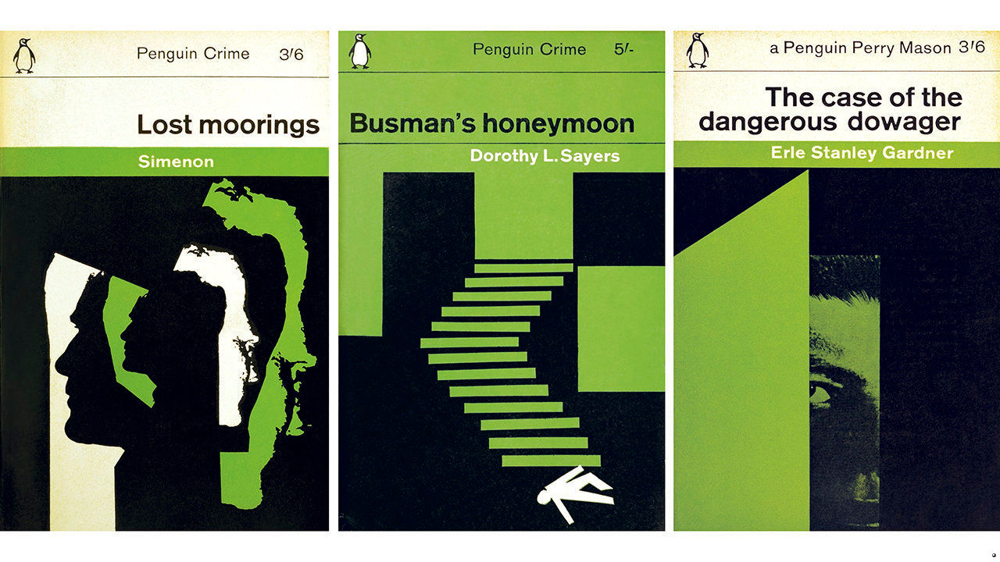

###### Order and peril

# Remembering Romek Marber, a master visual craftsman 

##### Born in Poland, he survived the Holocaust and helped transform graphic design in Britain 

 

> May 2nd 2020 

WHEN THE Gestapo burst into the safe house in Krakow where Romek Marber was hiding in 1943, they ordered him to face the wall. He had broken out of the Jewish ghetto in Bochnia, but his guide had betrayed him, and he expected to be killed on the spot. His mother, twin sister and grandparents had already been murdered. Marber leant his forehead against the dusky wallpaper, and for the rest of his life would remember the paper’s pattern—an ornate motif picked out in two shades of green.

He was 17. After the war he became one of Britain’s most distinguished graphic designers, whose haunting style will be familiar even if his name is not. When Poland was invaded in 1939 he fled Turek, his hometown, in a column of refugees that the Luftwaffe strafed. He led his family’s horses through blazing streets, watching adults make snap, life-and-death decisions about whether and where to run. Instead of being shot against the green wallpaper he was dispatched to Plaszow concentration camp; he survived that hell, and a death march, and a freezing, famished ride to Germany in an open railway wagon. Liberated just in time, he set off for Palestine and had reached the heel of Italy when his father and brother, alive and in London, wangled him a visa to join them.


An encounter with a dress-designer while he was sweeping the floors in a clothing factory led him to evening classes in drawing, then to St Martin’s College of Art (where he met his wife, Sheila Perry) and finally to the Royal College of Art. The grant he had received, for displaced Poles, stipulated that his course be vocational, and he picked commercial design. Graduating in 1956, he turned down a job in advertising and soon set up his own practice. By the early 1960s he was producing covers for magazines, including The Economist; he fondly recalled long waits in Soho pubs while the editors agreed on his theme. That piqued the interest of Penguin Books, which asked him to submit a new template for its crime covers, then to design 20 of them in a hurry, with many more to follow.

Marber’s dramatic imagery, with its sharp contrasts and suggestive spaces, bore traces of European modernism, and of Swiss typography in particular. He was one of a clutch of émigrés, many Jewish like him, who transformed the practice of design in Britain. The English, he later said, “still had a pre-war approach”, by which he meant “from the end of the 19th century”. Yet he had never studied on the continent, and, says Richard Hollis, an eminent designer and old friend, it was hard to make out his influences or know exactly where his techniques came from. His craftsmanship—which took in collage and cut-outs as well as drawing and photography—might now seem low-tech, but it imbued his work with depth and dynamism.

Orna Frommer-Dawson, his long-term partner after his wife died and another fellow designer, says a key part of his process was swift decision-making. Marber would pace up and down his studio, pondering a commission and smoking his pipe (a relative in Paris, believing that all Englishmen had one, gave him his first in 1946). Then, quickly, he would decide. Often the results shimmer with an unsettling tension that is his hallmark: between a pursuit of order and an undertow of peril.

 


The “Marber grid”, which he created for Penguin’s crime imprint and was later adopted for others, epitomised this blend of geometry and jeopardy. It arranged the title and author’s name in a precise format at the top of the jacket, leaving the space below open for uncanny, Hitchcockian silhouettes and eerily cropped figures. But the same blend of method and menace characterises his magazine covers. John F. Kennedy tries to call the Kremlin, but the receiver dangles unattended, the text skewed at a disorienting angle. Other Economist headlines swirl in concentric circles or twist across the page. On a cover of New Society, Harold Wilson, then Britain’s prime minister, looms behind an outsized fist. As art director of the Observer’s magazine Marber adorned a feature on the mafia with daggers and shadows. “Romek himself was not fearful,” says Ms Frommer-Dawson, “but when a subject needed to illustrate fear maybe he drew on his knowledge of what fear can be.”

He kept his Polish accent. Penny Garrett, a student at Hornsey College of Art where he served as head of graphic design (herself later art director of The Economist), remembers his smiling demeanour and tell-tale pronunciation: “As a matter of fuct…” Later the college was integrated into Middlesex University, where Marber became professor emeritus. But he rarely talked about his past, until, nudged by Mr Hollis, he published a wartime memoir in 2010. “In my memory I see all the faces as I left them, faces that have not grown older,” he wrote of his lost relatives. “However much I long to see Poland, I couldn’t go back.” He called the book “No Return”.

Marber died near his home in Essex on March 30th at the age of 94. But five years earlier, he did go back. The Galicia Jewish Museum in Krakow put on an exhibition of his work, and at the opening he addressed the guests in his elegant 1930s Polish, the first time he had visited the country in 70 years. He still could not return to Turek, where as a boy he rode in a haycart to his grandfather’s farm, eating cherries that the driver whipped from overhanging trees. But in Bochnia—where, on the night before he fled the ghetto, he “lost God”—he “remembered every street, every house”, says Tomasz Strug, the show’s curator.

In Krakow, where the Gestapo caught him, Ms Frommer-Dawson took a photo of Marber gazing at a poster for the exhibition, which adapted his cover for the novel, “Lost Moorings”. As he sometimes did, Marber had used himself as a model; the image shows several versions of his profile, jaggedly layered on top of one another in white, black and green. ■

