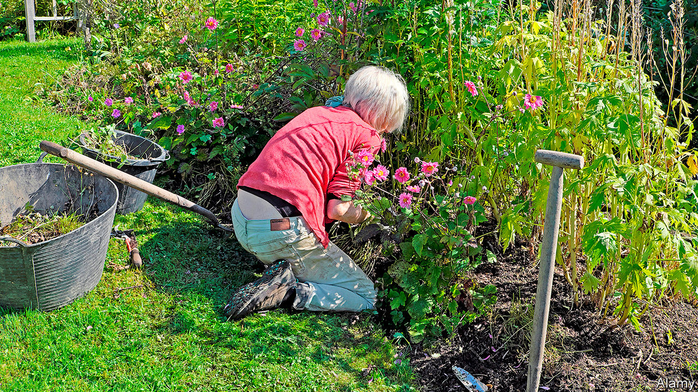

###### Life under lockdown

# A nation of gardeners 

##### Britons dig in for the lockdown 

 

> May 2nd 2020 

SUE BIGGS, director-general of the Royal Horticultural Society (RHS), a gardening charity, was “quite fearful” when the government ordered Britons into lockdown six weeks ago. She is single and has only her dog for company. But, like many of the society’s 500,000 or so members, she has found solace in her garden. “I have attacked the creeping buttercups with a vengeance,” she says. She ordered so many new plants that she had to dig up part of her lawn to squeeze them in.

Britain’s gardens have never been in better nick. Confined to their homes, folk are manicuring their hedges and lavishing attention on their vegetable patches. Official statistics show that 45% of Britons are coping with the lockdown by gardening, slightly more than are cooking or reading. Surveys suggest that between eight and nine in ten Britons have a private garden, pipping the share in France and Poland and dwarfing that in Spain, where a survey in 2014 found 27% had gardens. Millions watch flower shows that are screened on prime time television.


This national obsession is a mixture of temperature and temperament. Britain’s climate, with mild winters and plenty of rain, is particularly suited to gardening. And from the 18th century, aristocrats competed to hire the most renowned landscapers, such as Lancelot “Capability” Brown, to transform the grounds of their country estates. Victorian villas and suburban terraces, with gardens front and back, echoed these in miniature.

In a time of isolation and anxiety, the habit should stand Britons in good stead. Two new books—“The Natural Health Service” by Isabel Hardman, a journalist, and “A Well-Gardened Mind” by Sue Stuart-Smith, a psychiatrist—highlight the mental-health benefits of gardening. Studies suggest it is associated with significant reductions in depression and anxiety. Mrs Stuart-Smith sees it as a fundamentally optimistic activity. Even as plans for holidays and parties are being cancelled, imagining that a bunch of dull-looking seeds will transform into bright blooming flowers requires faith in the future.

Kew Gardens, a popular spot in a posh suburb of London, is closed, but Kew’s gardens are busier than ever. A few streets away, Lila Fenton, a management trainer, spends at least two hours a day in her garden. “I come down in the morning, make my coffee, then I check on my seedlings,” she says. She has clubbed together with neighbours to organise mass deliveries of plants and compost.

Gardens are so central to the lockdown experience that they have become a political issue. They are regularly cited to explain how the effects of the pandemic are unevenly felt. When councils began to close parks, politicians protested that tower-block dwellers would be deprived of their only green space. Boris Johnson, who spent much of his campaign for the Tory leadership in garden centres, is likely to heed pleas from plant-sellers to be allowed to reopen. More than two-thirds of growers’ sales are in the spring.

For now, the Kew Gardener, a nearby plant shop, is only taking orders online. But that has not stopped hopeful gardeners dropping by. Its owner, Daniel Slack, says one local asked him to pass a plant through the railings. He is not the only one looking for green shoots. ■

