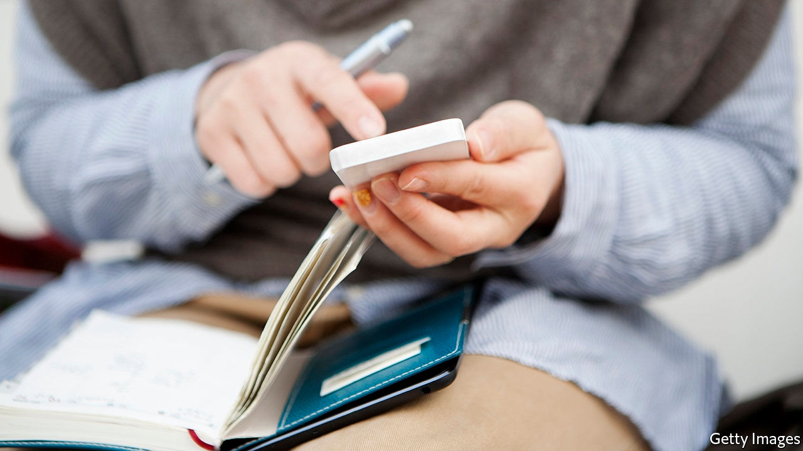

###### And then there were 18,000

# An army of sleuths could help Britain emerge from lockdown 

##### Human beings, rather than an app, may be the key 

 

> May 2nd 2020 

Editor’s note: The Economist is making some of its most important coverage of the covid-19 pandemic freely available to readers of The Economist Today, our daily newsletter. To receive it, register . For our coronavirus tracker and more coverage, see our 

“WHERE WERE you on the evening of Friday May 1st?” It is the sort of question one might expect to hear from a hard-boiled detective or a prosecutor in a courtroom drama. It is also the kind of question that Britons will have to get used to answering if daily life is to return to anything resembling normal.

Much of the focus of the government’s “test, track and trace” strategy to reopen Britain and prevent a second lockdown has been on testing and on an app being developed by NHSX, the digital-innovation arm of the health service. The app uses Bluetooth to register nearby devices that also have it installed. If an app-user shows symptoms of covid-19, she can report it through the app and grant permission for other users who have been in “close contact” with her to be informed. They would receive a message telling them that they may have been exposed, that they should self-isolate and what they should do next. If such people can also be quickly tested to establish whether they have the disease, that will allow the majority of the population to go about their lives while a small number of people stay home and recover or go to hospital for treatment.


That is the theory, anyway. In reality, take-up of the app may be considerably lower than 60% of the population, the number at which it would be truly effective. In Singapore, which was early to roll out a similar app, less than a fifth of the population has downloaded it. In Australia, less than a tenth has.

Even with widespread adoption, an app-based system is still a relatively blunt tool. “An app can tell us you and I were within two metres of each other, but there is a different process if we had a conversation in a sealed room for two hours or in the open air with the wind blowing. Human judgment needs to be applied,” says Chris Yiu of the Tony Blair institute, which has published detailed analyses of strategies to come out of lockdown. It’s not a choice between technology and people. “International best practice is very clear on this: you need both,” says Jeremy Hunt, who chairs the House of Commons health and social care select committee.

That is why the third pillar of the government’s alliterative slogan is “trace”. At the start of the crisis Public Health England (PHE), a government agency, had 290 “contact tracers”, or people who call patients and ask them about their movements and whom they have been around in recent days. Think of them as the public-health equivalent of the nosy detective, except that they are soft-boiled and rely on the co-operation of their interviewees. Now the plan is to increase that number fast to 18,000, of whom 3,000 will be medical professionals and the rest call-handlers.

Firms such as Serco, a big contractor, are in talks with the government to provide the workforce. It should be possible to train new recruits fairly quickly—the requirements of the job are similar to those of 111 operators, for whom the training time is just four hours. They will work from a script that guides them through the various stages of an interview.

Most people have no idea what they were doing on the evening of a particular day two weeks ago. “So what you try to do is you break the day up into segments,” says Dr Azeem Majeed, a public-health expert at Imperial College London. As Britons wait for the army of new tracers to be hired, and indeed for a tracking app to download, one way to fill the days may be to get in the habit of keeping a diary. ■

Dig deeper:For our latest coverage of the covid-19 pandemic, register for The Economist Today, our daily , or visit our 

