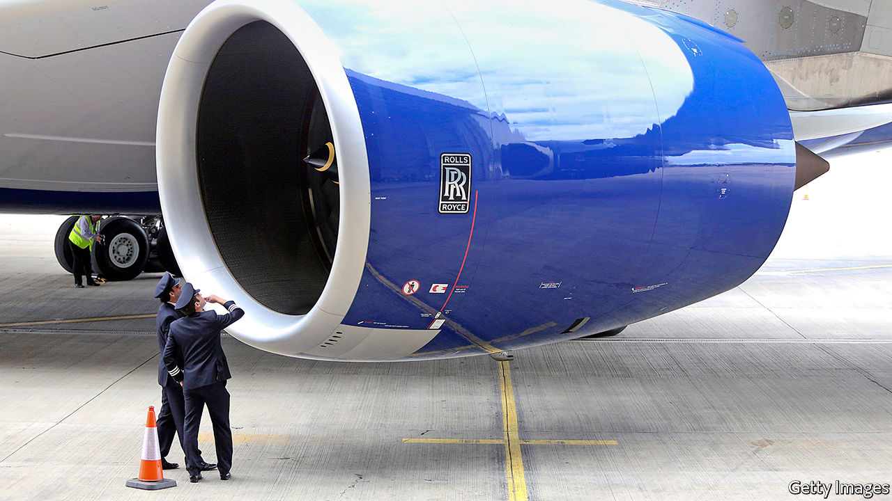

###### Redundancies

# British Airways’ huge job cuts 

##### Measures to freeze the economy in place have limited impact 

 

> May 2nd 2020 

Editor’s note: The Economist is making some of its most important coverage of the covid-19 pandemic freely available to readers of The Economist Today, our daily newsletter. To receive it, register . For our coronavirus tracker and more coverage, see our 

RARELY, IF EVER, has the economic outlook shifted so rapidly, leaving firms struggling to respond. On April 2nd, as demand for air travel collapsed, British Airways placed 30,000 of its 42,000 employees on the government-backed furlough scheme. Less than a month later Alex Cruz, the chief executive, wrote to staff to say that “in the last few weeks, the outlook for the aviation sector has worsened further” and that around 12,000 staff would now be facing redundancy.

Travel restrictions, lockdowns and social distancing measures have hit airlines especially hard. The International Air Travel Association, a trade body, reckons that global revenues will be down by 55% in 2020. In an update to investors IAG, British Airways’ parent company, said that passenger capacity in April and May this year would be 94% lower than in 2019, and it was unable to give firm guidance on the outlook for revenues and profits this year. British Airways believes it will be “several years” before demand fully recovers to pre-pandemic levels.


The government has sought to use wage subsidies and soft loans to support companies while public-health needs mean economic activity is suppressed. The intention was to freeze the economy in place for weeks or months and prevent the kind of job losses and business failures that would be a lasting drag on the economy. But that approach relies on the idea that things will eventually return to normal and as Mr Cruz put it in his message to staff “what we are facing as an airline, like so many other businesses up and down the country, is that there is no ‘normal’ any longer.”

Demand for transport services, especially international ones, is unlikely to bounce back rapidly. Hospitality firms, such as restaurants and pubs, are likely to be forced to operate well below capacity to maintain distancing. Non-essential shops will probably experience lower footfalls. As firms in these sectors reassess the outlook, they are being forced into making tough choices now.

The government’s retention scheme, under which it pays 80% of a worker’s salary up to £2,500 a month ($3,100), bought firms some breathing space. It was initially due to run until the end of May but has since been extended to June. Businesses accept that the Treasury cannot pay their wage bills indefinitely but are asking for more clarity on how support will be phased out. The worry for many is that the scheme will end abruptly, leaving them saddled with costs that they can no longer cover. For firms like British Airways, the end of the scheme is already looming and, given the statutory 45-day consultation period for redundancies, they must make decisions quickly. A survey from the Chartered Institute of Personnel and Development, an employer body, found that just 7% of firms have made covid-19 related redundancies so far but a further 12% are planning to lay people off. ■

Dig deeper:For our latest coverage of the covid-19 pandemic, register for The Economist Today, our daily , or visit our 

