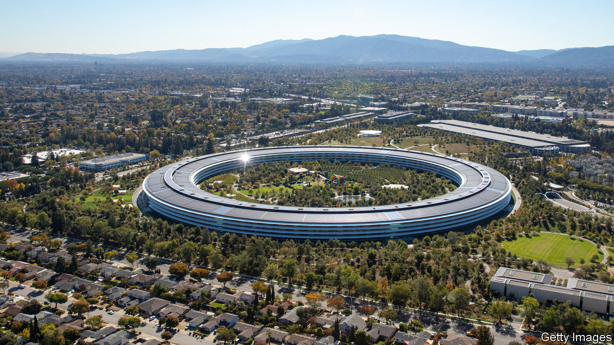

###### West-coast shuffle

# Big tech is thriving in the midst of the recession 

##### Its centre of gravity is shifting, too 

 

> May 2nd 2020 

Editor’s note: The Economist is making some of its most important coverage of the covid-19 pandemic freely available to readers of The Economist Today, our daily newsletter. To receive it, register . For our coronavirus tracker and more coverage, see our 

THE TECHNOLOGY industry has never been more economically important. The biggest five Silicon Valley firms now make up about 20% of the value of the S&amp;P 500 stockmarket index of big American companies. Yet until recently no one had much idea of how these vast, essential businesses would fare in an economic downturn. When the last slump started in 2007, Facebook was only four years old, Amazon was a twentieth of its size today, and Apple made more cash from Mac computers than from iPhones.

So how is big tech doing? An obvious—and frequently made—point is that the industry is thriving amid a savage recession as people spend more time on screens and work remotely. Look closer, however, and the picture is more complex. The industry is tilting away from business models that ruled in the past decade, towards a new era of subscriptions, e-commerce and business infrastructure. A simple way of putting it is that tech’s spiritual centre of gravity is moving from San Francisco to Seattle.


The level of pain being endured by more traditional big firms is hard to overstate. On April 29th Ford said that it would lose $5bn this quarter while Boeing is going through $4.7bn of cash every three months. Compared with that, the tech firms are on a roll. Alphabet, Google’s parent, saw sales rise by 13% in the first quarter compared with the year before, and profits reached $7bn. Facebook’s 3bn users are spending more time on its services. Microsoft, now the most valuable tech firm, booked profits of $10.8bn for the quarter.

Yet behind those figures are hints of vulnerability. Advertising revenue, the main source of income for Alphabet and Facebook, is under pressure. Google saw spending on search adverts drop by about 15% in March compared with the year before. Small-business clients, in particular, are forking out less as the recession bites. Another area of weakness may be smartphone sales, which are typically sold through retail stores and rely on fiddly supply chains. As The Economist went to press, Apple had yet to report, but both Samsung and Qualcomm, which make money from handsets, have warned that sales of devices may fall (see ). Among firms that rely on human contact, meanwhile, there is a brutal shake-out. Lyft, a ride-sharing firm which went public a year ago, plans to fire 17% of its workforce.

Just as some of the ingredients that defined the previous era grow stale, new sources of growth are becoming clearer. Instead of bombarding consumers with advertising, subscriptions are booming. Netflix, a streaming giant, added 16m new subscribers in the quarter to March. Spotify, a music service, posted similar gains (it also reported a surge in listeners searching for “chill”). Microsoft is providing the crucial infrastructure for remote working, alongside new stars such as Zoom. And Amazon has shown that many countries cannot live without its cloud-computing arm, AWS, and its booming e-commerce operation.

Heading north

The big firms that are less well positioned are adapting fast to this emerging new era. Facebook is rushing to beef up its video-call offering. Google is boosting its cloud-computing operation and, to stimulate demand, Apple is discounting phones and promoting its services arm. But for now the winners are Microsoft and Amazon, both based farther north on the Pacific Shelf, in Seattle. The crisis has illuminated big tech’s resilience—but also that the balance of power is shifting.■

Dig deeper:For our latest coverage of the covid-19 pandemic, register for The Economist Today, our daily , or visit our 

