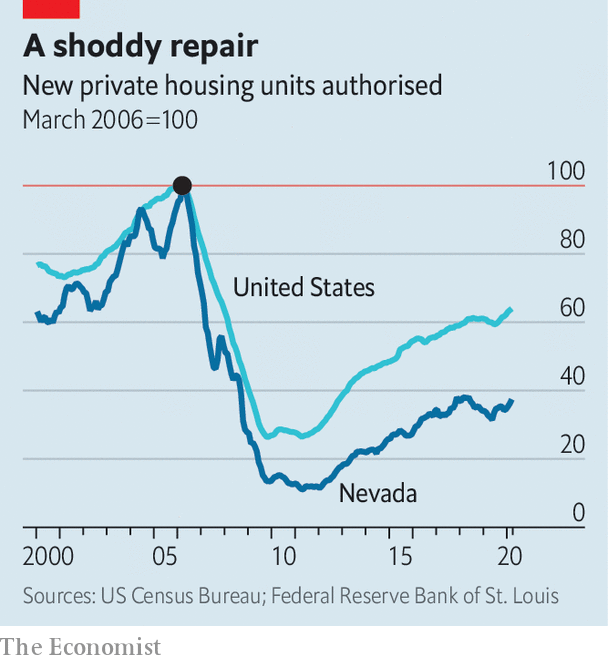

###### The house loses

# America is getting worse at building new homes 

##### Even before covid-19 struck, housing supply was not responding to demand as it ought to 

 

> May 2nd 2020 

OVER A DECADE on from its almighty bust, Nevada’s housing market was on a roll. Since 2015 house prices have risen by 10% a year, not far off the dizzying price growth of the years leading up to the financial crisis. In 2019 just 2% of houses in Nevada lay empty, close to a record low—and quite a change from the early 2010s, when abandoned properties with “No Trespassing” signs blighted the suburbs of Las Vegas. Yet even before the pandemic, something was amiss with Nevada’s housing market. Though it looks as if there was money to be made, housebuilding has been remarkably weak (see chart).

 


Nevada is an extreme example of a national trend. Housing costs are high and have been rising, especially in prosperous cities. Vacancy rates are at rock-bottom. Yet builders are oddly cautious. A recent Bank of England working paper from Knut Are Aastveit, Bruno Albuquerque and André Anundsen finds that housing-supply elasticities—ie, the extent to which building responds to demand—have dropped since the pre-crisis boom, not just in Las Vegas but across the country. Before covid-19 hit, housebuilding was 20% lower than it was before the financial crisis in other G7 countries. In America it was 40% lower. This is a sorry state of affairs for the one in two American renters who devote more than 30% of their pre-tax income to housing, and for those who cannot afford to buy their first home. Unless there is more building, housing will remain dear. Depending on the region, up to three reasons explain what has gone wrong.


The first relates to the rising cost of construction, which makes fewer projects viable. In the past decade it has become harder to find workers, in part because of fewer arrivals from Latin America. Labour costs have risen: in March construction-workers’ pay in Nevada was 6% higher than it was a year ago. Meanwhile, since Donald Trump came to office and slapped tariffs on various imports, the cost of building materials has risen faster than overall prices.

A second factor—tighter regulations—may play an even bigger role. Developers now have to jump through more regulatory hoops than before, which stop them building the dwellings that the modern economy demands. According to a recent paper by Joseph Gyourko of the University of Pennsylvania and colleagues, project-review times have increased in many areas since the mid-2000s. The share of areas imposing minimum-lot-size restrictions (which make it more difficult to build dense housing) has risen from 84% to 94%.

In some places NIMBYism is now virulent. Berkeleyside, a news website, reported in February that a resident in California opposed a new development on the ground that the incomers’ pets were “all going to come to my house and poop on my lawn”. Mr Aastveit’s co-written paper, in slightly more formal language, finds that “housing-supply elasticities have declined more in areas where land-use regulation has tightened the most.”

No one knows for sure why Americans have become less receptive to new housing development. Some say it is merely the continuation of a long historical trend (the regulation of land has been getting tighter since at least the 1960s). Another is that, following the bust a decade ago, homeowners are especially keen to preserve their property values, and are thus trying harder than they were to block development.

Ed Glaeser of Harvard University floats another intriguing theory—that places with lots of progressive folk are more likely to oppose development. Certainly, in liberal utopias such as Burlington and San Francisco, where residents flaunt their environmentalist and anti-gentrification credentials, getting any housing development off the ground is a nightmare. Political scientists have noted that in recent years America’s cities have shifted leftwards. More acute NIMBYish tendencies may be the consequence.

Yet housebuilders are not merely the victims of overbearing bureaucrats or sharp-elbowed activists. The third reason for America’s housing scarcity is linked to a problem that now afflicts many markets, from airlines to beer to hospitals. Housebuilding is less competitive than it once was. In many areas a small number of big firms have come to dominate the market, in part because of a series of big mergers and in part because only big firms can navigate increasingly complicated regulations. Since the recession the market share of Las Vegas’s top three housebuilders has increased from one-third to over 40%, according to Home Builders Research, a local firm. Other markets across America have seen similar trends.

Economic theory suggests that firms with market power may reduce their output if it helps them maximise their profits. A new paper from Jacob Cosman and Luis Quintero, both of Johns Hopkins University, finds evidence of this. The rise in market concentration in housebuilding since the recession has lowered annual housing construction by about 150,000—or roughly one-third of the current shortfall.

The disruptions associated with the coronavirus pandemic will slow down construction for some time. But even when the economy recovers, housebuilding may not. Though there are stirrings of a “YIMBY” movement—“Yes In My Back Yard”—where activists push for regulatory changes to make it easier to build, the forces pressing down on housing construction are strong. Immigration policies continue to deprive construction of much-needed labour. Few politicians are interested in solving America’s competition problem—and the big housebuilders enjoy being the only ones who understand increasingly gnarly regulations. It could be some time before housebuilding is once again on a roll.■

