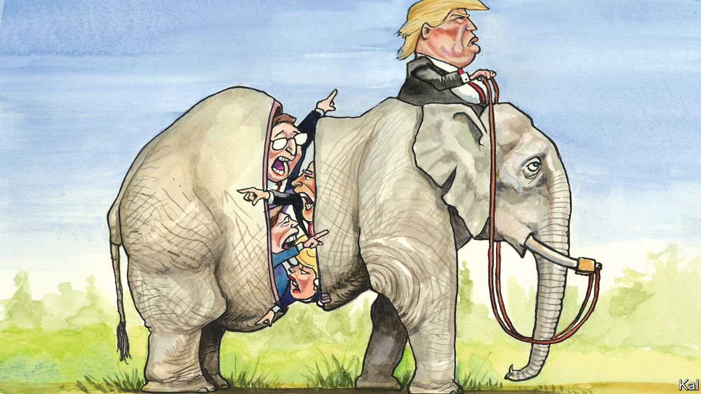

###### Lexington

# Conservatism in the crisis 

##### The pandemic has emboldened conservative proponents of a more expansive view of government 

 

> May 2nd 2020 

FOLLOWING THE strangely tidy conclusion to their presidential primary, the Democrats are marching in lockstep. This week Senator Kirsten Gillibrand, queen of the #MeToo movement, dismissed an allegation of sexual assault against Joe Biden on the basis that the former vice-president had denied it. Al Franken and Brett Kavanaugh would have been glad of the same treatment.

Meanwhile the Republicans appear to be trying to fill the role of feuding opposition their rivals have vacated. The only stiff resistance to the $3trn stimulus authorised by Congress came from their ultra-libertarian wing. One of its members, Congressman Thomas Massie, accuses his colleagues of “abandoning” conservative principles by tiding over America’s shuttered economy. It seems he was not mollified by Mitch McConnell’s more tactical small-governmentism, displayed in the Senate leader’s opposition to bailing out stricken Democratic states. Larry Hogan, the pragmatic Republican governor of Maryland, called letting states go bankrupt “complete nonsense”. Meanwhile a former compadre of Mr Massie in the House Freedom Caucus, Justin Amash, declared a plan to run for president for the Libertarians.


Another querulous Republican faction looks closer to the grain of the crisis. Led by some of the most interesting conservative thinkers, including Yuval Levin and Oren Cass, plus a handful of senators, it rejects Mr Massie’s market fundamentalism and takes a more flexible and positive view of government than most Republicans have since the 1970s. Its members, who include Trump-style populists and the remnants of a reform conservative movement that began in the doldrums of George W. Bush’s presidency, want to turn the party’s attention from economic freedom to socioeconomic outcomes, from corporations to workers. A pro-poor redesign of one stimulus bill by Senators Tom Cotton, Mitt Romney and Marco Rubio, all affiliated with this faction, was an indication of its growing alignment. Its members believe the crisis has validated their position and pushed it to the centre of politics.

Mr Rubio said as much in a searing critique of his party’s economic libertarianism in the New York Times last week. He connected the damage it has done to some working-class communities, the loss of industrial capacity exposed by the crisis and the absence of adequate stockpiles of the medical supplies America no longer makes. All, he argued, are products of a misguided homage to economic efficiency, rooted in a “hyperindividualistic ethos”, that the coronavirus has shown to be self-defeating as well as immoral. To address these inadequacies, he would boost domestic production through a range of industrial and labour policies.

Mr Cass, who on May 5th will launch an impressive organisation of this dissident faction, called American Compass, would go further. A former policy director for Mr Romney, he describes the crisis similarly as an indictment of an “economic piety” that ignores many values that markets do not capture, including the well-being of American workers and development of future industries. “Supply chains are much more than whoever is promising to make something more cheaply tomorrow,” he says. In an influential book on labour-market reform, he has proposed a range of novel fixes, including wage subsidies and labour unions, and some familiar ones, including more aggressive deregulation than even Mr McConnell might consider feasible.

Politics does seem to be moving towards the dissidents. With the government standing between millions of Americans and ruin, hardly anyone, maybe not even Mr Massie, will propose starving the beast for a bit. The crisis is also likely to slow and, in specific industries such as health care, reverse globalisation. Yet the Republican quarrelling and rise of the dissidents are mainly a response to the equally disorientating reality of Donald Trump.

The president’s lack of attachment to any Republican faction has encouraged all to claim to be the animating spirit of his revolution. The Freedom Caucus claim him for their pugnacious anti-establishmentarianism. The small-government establishment notes that his only big legislative achievement was the tax reform it designed. The dissidents claim more convincingly to be offering solutions to the working-class grievances Mr Trump highlighted on the trail, even though he has since jettisoned them.

This may explain why their programme seems more political than the cerebral Mr Cass would care to admit. There is a rational and, given his focus on strengthening institutions, conservative case for his proposed labour-market reforms. The same cannot be said for the immigration curbs and laissez-faire attitude towards climate change he also advocates. Both look like pandering.

That is forgivable to a degree. Even critics of Mr Rubio and Mr Cass should recognise that their proposals are the most direct answer to the president’s ethno-nationalism available. Going back to the hoary question of whether his working-class fans were incited more by economic or by racial anxiety, Mr Trump’s behaviour suggests he thinks it was the latter; Mr Rubio et al refuse to accept that.

Neoreformacon-ism

The irony of this is that they have fashioned a virtuous Trumpian agenda that has little or no chance of being promulgated under Mr Trump. No more are the libertarians or small-government pharisees or pragmatists like Mr Hogan hopeful of influencing his scattergun administration. All are wrestling to claim the post-Trump future of their party—which leads to two further conclusions.

First, that future will be determined not by ineluctable socioeconomic forces but by whoever wins the party’s next presidential nomination. The Democrats’ embrace of fiscal rectitude in the 1990s now looks inevitable. But had Bill Clinton not scrambled to a second-place finish in New Hampshire, it would not have happened. Second, the fact that Republicans are feuding only six months from a general election suggests that many of them believe their post-Trump future may not be far off.■

