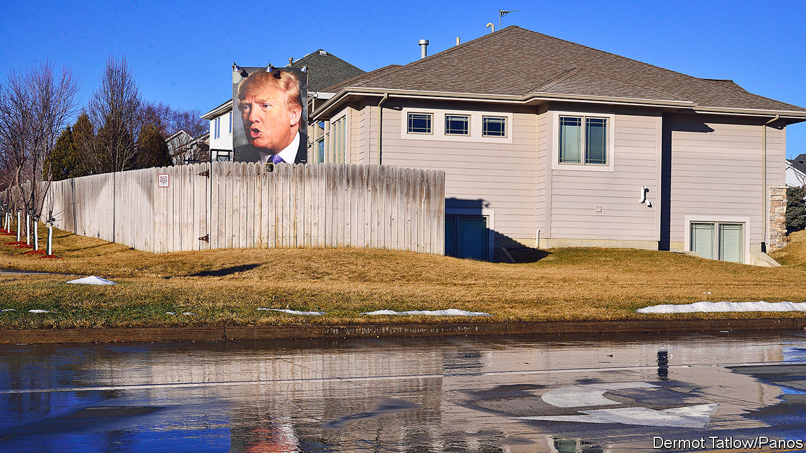
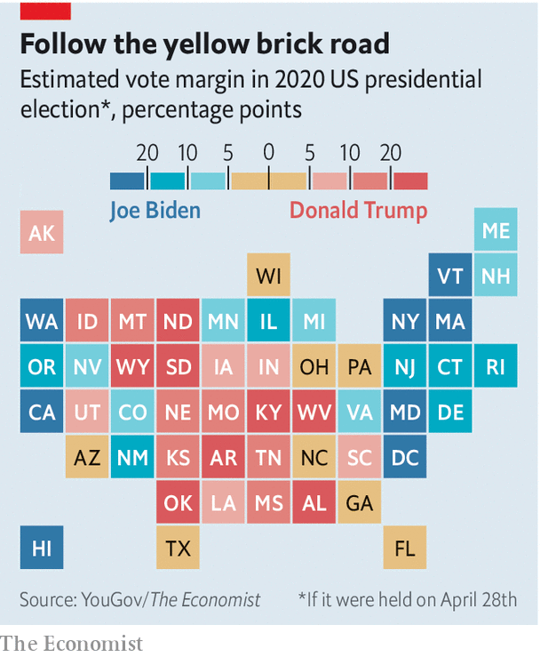
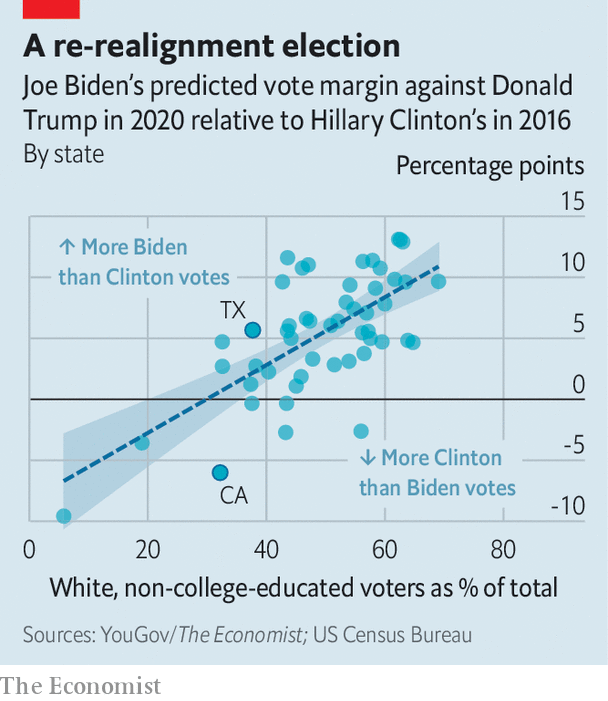

###### Election monitoring

# We spent the lockdown sorting American voters into 380,000 distinct groups 

##### What did this exercise suggest about how November’s presidential election will go? 

 

> May 2nd 2020 

Editor’s note: The Economist is making some of its most important coverage of the covid-19 pandemic freely available to readers of The Economist Today, our daily newsletter. To receive it, register . For our coronavirus tracker and more coverage, see our 

YOU WOULD think that everything about this year’s presidential election has changed over the past month. With coronavirus sweeping the country, President Donald Trump suggesting that Americans might want to disinfect their veins and Joe Biden going underground, such an assumption would appear reasonable.

State-level political polls, which are known to oscillate wildly from day to day, show the former vice-president gaining a lot of ground in recent weeks. Yet there is actually little evidence that the picture has changed at all since February. Mr Trump’s approval ratings are exactly where they were when the outbreak of covid-19 began. Properly weighted public opinion polls that account for interviewees’ political affiliations reveal that Mr Biden holds just the same lead over the president as he did back in March.


Mr Biden looks a bit stronger than that slight edge would imply. The former vice-president is polling better than Hillary Clinton did where it matters most: among white voters in the Midwest, who have outsize importance in the electoral college. Though he is losing ground with non-whites and younger voters, their distribution across the country gives them less influence in presidential elections than they ought to have. The sudden economic slump has also affected Mr Trump’s re-election odds, though less than you might think. As a result, Mr Biden starts the campaign ahead of Mr Trump.

 


To gauge the candidates’ strengths with a variety of demographic groups, The Economist used a statistical technique called “multilevel regression and poststratification” (MRP) that takes raw survey data collected by YouGov, a pollster, and produces finely-detailed predictions for many different types of voters. We know how white women with a college degree lean Democratic, for example, and how white Christian men from Michigan tend to vote for Republicans. And since we also know how many people of each type live in each state, we can estimate how the race would play out if the election were held today.

This method is not unlike the one used by Simulmatics Corporation, which in 1960 fed a primitive computer decades’ worth of polls from George Gallup and Elmer Roper to advise Kennedy on a winning strategy. The scientists behind Simulmatics made predictions for 480 types of voters. Based on data about nearly 9,000 voters collected by YouGov in March and April, we have made predictions for over 380,000 types, one for each combination of nine different demographic and geographical factors.

Our MRP model tells us both whether people are likely to vote, and who they will support if they do. Our method adjusts for many of the factors that increase the variance of live-caller polls, chiefly by ensuring a balanced sample of Democrats, Republicans and independents in each state. Perhaps most important, MRP allows us to fill in the blanks where public polling is scarce, which was a big problem when handicapping the 2016 election.

 


Currently our model estimates that 41% of whites who cast ballots would vote for Mr Biden if the election were held today, whereas 51% say they will cast their lot for Mr Trump—a ten-percentage-point margin. In 2016 Mrs Clinton lost this group by 15 points. Mr Biden has improved his standing both among whites who have college degrees and the ever-watched group of those who do not. He polls four and six percentage points better than Mrs Clinton did among each group, respectively. Mr Biden is currently polling 11 points better than Mrs Clinton in states where working-class white voters make up the largest share of the electorate, and he is performing roughly six points worse in those states where they are the lowest share (see chart).

That improvement has a disproportionate effect on Mr Biden’s chances of victory. Whereas Mrs Clinton lost the election by small margins in Wisconsin, Michigan and Pennsylvania, we find Mr Biden with a slight lead in all three. He is also likely to beat Mrs Clinton’s margin in Arizona, which is likelier than any of the midwestern battlegrounds to tip the election.

That is despite Mr Biden faring relatively poorly with non-white voters and with younger ones. YouGov’s data suggest that African-Americans favour Mr Biden over Mr Trump by a 72-percentage-point margin. That sounds impressive—yet Mrs Clinton won the same group by 80 points. Hispanics, too, have shifted away from the Democrats. Whereas Mrs Clinton won them by 38 points, they now say they will vote for Mr Biden by 28. In other words, Mr Trump is polling a bit better with blacks and Hispanics than he did last time round.

Young voters, a large majority of whom are Democrats, are also less likely to support the vice-president than they were to back Mrs Clinton. But the majority of eligible voters younger than 30 do not typically vote: only 43% of them showed up to the polls in 2016, based on numbers from the Census Bureau. And even though YouGov’s data suggest nearly 70% of all eligible adults will vote in November, the model expects only 53% of voters under the age of 30 to do so. Young people are also concentrated in the safest Democratic states, so are unlikely to have a large sway over the election. Thus Mr Biden can prosper despite a relatively weak performance among the Democratic Party’s core constituencies, because the electoral college makes them less important than they would be if the presidency were decided by a popular vote.

Guessing now how things will be in November is hard, for obvious reasons. In the past, one of the best predictors of a president’s chances has been the state of the economy. Today, after a 4.8% decline in GDP (at an annual rate) in the first quarter, any model that puts weight on that correlation predicts a blowout Biden win. Yet thanks to political polarisation, most voters no longer blame (or reward) the president for economic conditions.

The biggest constant since 2016 is that Mr Trump has retained his relative advantage in the electoral college. Because rural states both lean Republican and are rewarded with a disproportionately large number of votes, the deck is stacked in his favour. According to our MRP estimates, the president could lose the popular vote by two-to-three percentage points and still win the majority of electoral-college votes. His path to victory again runs through the Midwest, though he has added Minnesota and New Hampshire to his list of heavily working-class states that could flip from Democratic in 2016 to Republican in 2020.

That scenario looks unlikely at the moment, however. After all the fancy maths, six months before the election, Mr Biden is six points ahead of Mr Trump. If the vote were held today he would probably win.■

Dig deeper:


